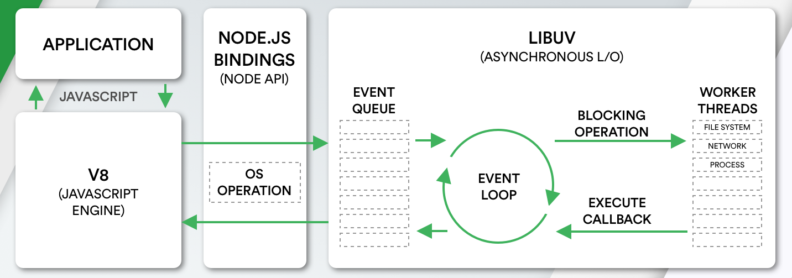
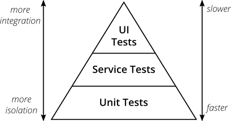
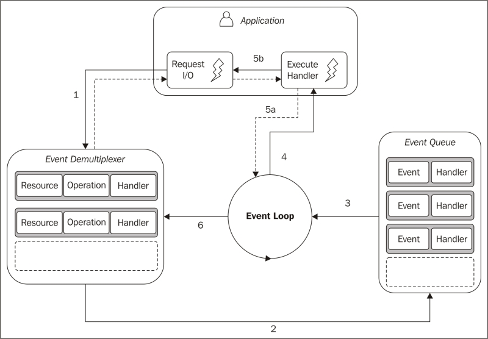
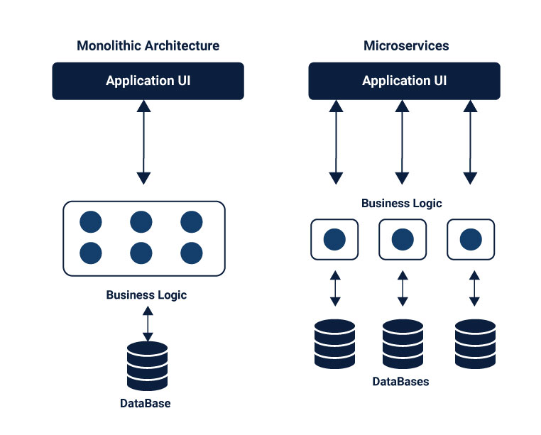
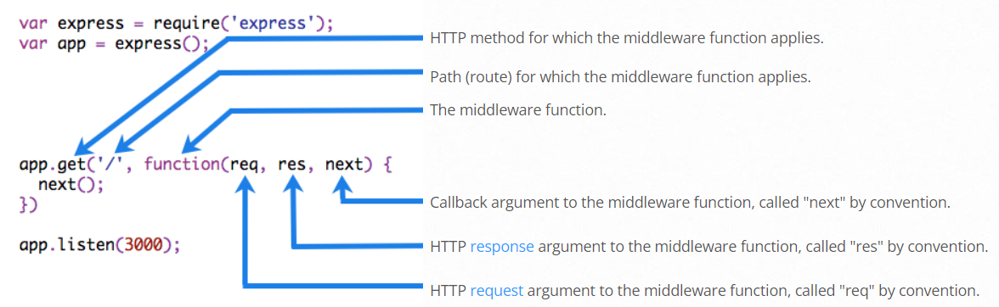

# Node.js Interview Questions

*Click  if you like the project. Pull Requests are highly appreciated.*

## Table of Contents

* *[NodeJS APIs](nodejs-api.md)*
* *[NodeJS Coding Practice](nodejs-programming.md)*
* *[NodeJS Commands](nodejs-commands.md)*

<br/>

| Sl.No|  Questions       |
|------|------------------|
| 01. |[What does the runtime environment mean in Node.js?](#q-what-does-the-runtime-environment-mean-in-nodejs)|
| 02. |[What is Node.js?](#q-what-is-nodejs)|
| 03. |[What is Node.js Process Model?](#q-what-is-nodejs-process-model)|
| 04. |[What are the data types in Node.js?](#q-what-are-the-data-types-in-nodejs)|
| 05. |[How to create a simple server in Node.js that returns Hello World?](#q-how-to-create-a-simple-server-in-nodejs-that-returns-hello-world)|
| 06. |[How do Node.js works?](#q-how-do-nodejs-works)|
| 07. |[What is an error-first callback?](#q-what-is-an-error-first-callback)|
| 08. |[What is callback hell in Node.js?](#q-what-is-callback-hell-in-nodejs)|
| 09. |[What are Promises in Node.js?](#q-what-are-promises-in-nodejs)|
| 10. |[What tools can be used to assure consistent style?](#q-what-tools-can-be-used-to-assure-consistent-style)|
| 11. |[When should you npm and when yarn?](#q-when-should-you-npm-and-when-yarn)|
| 12. |[What is a stub?](#q-what-is-a-stub)|
| 13. |[What is a test pyramid? How can you implement it when talking about HTTP APIs?](#q-what-is-a-test-pyramid-how-can-you-implement-it-when-talking-about-http-apis)|
| 14. |[How can you secure your HTTP cookies against XSS attacks?](#q-how-can-you-secure-your-http-cookies-against-xss-attacks)|
| 15. |[How can you make sure your dependencies are safe?](#q-how-can-you-make-sure-your-dependencies-are-safe)|
| 16. |[What is Event loop in Node.js? How does it work?](#q-what-is-event-loop-in-nodejs-how-does-it-work)|
| 17. |[What is REPL? What purpose it is used for?](#q-what-is-repl-what-purpose-it-is-used-for)|
| 18. |[What is the difference between Asynchronous and Non-blocking?](#q-what-is-the-difference-between-asynchronous-and-non-blocking)|
| 19. |[How to debug an application in Node.js?](#q-how-to-debug-an-application-in-nodejs)|
| 20. |[What are some of the most popular packages of Node.js?](#q-what-are-some-of-the-most-popular-packages-of-nodejs)|
| 21. |[What is EventEmitter in Node.js?](#q-what-is-eventemitter-in-nodejs)|
| 22. |[How many types of streams are present in node.js?](#q-how-many-types-of-streams-are-present-in-nodejs)|
| 23. |[What is crypto in Node.js? How do you cipher the secure information in Node.js?](#q-what-is-crypto-in-nodejs-how-do-you-cipher-the-secure-information-in-nodejs)|
| 24. |[What is the use of DNS module in Node.js?](#q-what-is-the-use-of-dns-module-in-nodejs)|
| 25. |[What are the security mechanisms available in Node.js?](#q-what-are-the-security-mechanisms-available-in-nodejs)|
| 26. |[Name the types of API functions in Node.js.](#q-name-the-types-of-api-functions-in-nodejs)
| 27. |[How does Node.js handle child threads?](#q-how-does-nodejs-handle-child-threads)|
| 28. |[What is the preferred method of resolving unhandled exceptions in Node.js?](#q-what-is-the-preferred-method-of-resolving-unhandled-exceptions-in-nodejs)|
| 29. |[How does Node.js support multi-processor platforms, and does it fully utilize all processor resources?](#q-how-does-nodejs-support-multi-processor-platforms-and-does-it-fully-utilize-all-processor-resources)|
| 30. |[What is typically the first argument passed to a Node.js callback handler?](#q-what-is-typically-the-first-argument-passed-to-a-nodejs-callback-handler)|
| 31. |[How Node.js read the content of a file?](#q-how-nodejs-read-the-content-of-a-file)|
| 32. |[What is JIT and how is it related to Node.js?](#q-what-is-jit-and-how-is-it-related-to-nodejs)|
| 33. |[What is difference between put and patch?](#q-what-is-difference-between-put-and-patch)|
| 34. |[List types of Http requests supported by Node.js.](#q-list-types-of-http-requests-supported-by-nodejs)
| 35. |[Why to use Express.js?](#q-why-to-use-expressjs)|
| 36. |[Write the steps for setting up an Express JS application.](#q-write-the-steps-for-setting-up-an-express-js-application)
| 37. |[Since node is a single threaded process, how to make use of all CPUs?](#q-since-node-is-a-single-threaded-process-how-to-make-use-of-all-cpus)|
| 38. |[What does emitter do and what is dispatcher?](#q-what-does-emitter-do-and-what-is-dispatcher)|
| 39. |[How to kill child processes that spawn their own child processes in Node.js?](#q-how-to-kill-child-processes-that-spawn-their-own-child-processes-in-nodejs)|
| 40. |[What do you understand by Reactor Pattern in Node.js?](#q-what-do-you-understand-by-reactor-pattern-in-nodejs)|
| 41. |[What are the key features of Node.js?](#q-what-are-the-key-features-of-nodejs)|
| 42. |[What are globals in Node.js?](#q-what-are-globals-in-nodejs)|
| 43. |[What is chaining process in Node.js?](#q-what-is-chaining-process-in-nodejs)|
| 44. |[What is a control flow function? what are the steps does it execute?](#q-what-is-a-control-flow-function-what-are-the-steps-does-it-execute)|
| 45. |[What is npm in Node.js?](#q-what-is-npm-in-nodejs)|
| 46. |[When to use Node.js and when not to use it?](#q-when-to-use-nodejs-and-when-not-to-use-it)|
| 47. |[Explain how does Node.js work?](#q-explain-how-does-nodejs-work)|
| 48. |[Is Node.js entirely based on a single-thread?](#q-is-nodejs-entirely-based-on-a-single-thread)|
| 49. |[How to make post request in Node.js?](#q-how-to-make-post-request-in-nodejs)|
| 50. |[Can you create http server in Node.js, explain the code used for it?](#q-can-you-create-http-server-in-nodejs-explain-the-code-used-for-it)|
| 51. |[How to load html in Node.js?](#q-how-to-load-html-in-nodejs)|
| 52. |[How can you listen on port 80 with Node?](#q-how-can-you-listen-on-port-80-with-node)|
| 53. |[What is the difference between operational and programmer errors?](#q-what-is-the-difference-between-operational-and-programmer-errors)|
| 54. |[Why npm shrinkwrap is useful?](#q-why-npm-shrinkwrap-is-useful)|
| 55. |[What is your favourite HTTP framework and why?](#q-what-is-your-favourite-http-framework-and-why)|
| 56. |[What are the Challenges with Node.js?](#q-what-are-the-challenges-with-nodejs)|
| 57. |[What is the difference between Node.js vs Ajax?](#q-what-is-the-difference-between-nodejs-vs-ajax)|
| 58. |[How Node.js overcomes the problem of blocking of I/O operations?](#q-how-nodejs-overcomes-the-problem-of-blocking-of-i-o-operations)|
| 59. |[Mention the steps by which you can async in Node.js?](#q-mention-the-steps-by-which-you-can-async-in-nodejs)|
| 60. |[What are the timing features of Node.js?](#q-what-are-the-timing-features-of-nodejs)|
| 61. |[What is LTS releases of Node.js why should you care?](#q-what-is-lts-releases-of-nodejs-why-should-you-care)|
| 62. |[Why should you separate Express 'app' and 'server'?](#q-why-should-you-separate-express-app-and-server)|
| 63. |[What is the difference between process.nextTick() and setImmediate()?](#q-what-is-the-difference-between-processnexttick-and-setimmediate)|
| 64. |[What is difference between JavaScript and Node.js?](#q-what-is-difference-between-javascript-and-nodejs)|
| 65. |[What are the difference between Events and Callbacks?](#q-what-are-the-difference-between-events-and-callbacks)|
| 66. |[Explain RESTful Web Services in Node.js?](#q-explain-restful-web-services-in-nodejs)|
| 67. |[How to handle file upload in Node js?](#q-how-to-handle-file-upload-in-node-js)|
| 68. |[Explain the terms body-parser, cookie-parser, debug, jade, morgan, nodemon, pm2, serve-favicon, cors in Express JS?](#q-explain-the-terms-body-parser-cookie-parser-debug-jade-morgan-nodemon-pm2-serve-favicon-cors-in-express-js)|
| 69. |[How does routing work in Node.js](#q-how-does-routing-work-in-node-js)|
| 70. |[How Node prevents blocking code?](#q-how-node-prevents-blocking-code)|
| 71. |[What is difference between promise and async await in node js?](#q-what-is-difference-between-promise-and-async-await-in-node-js)|
| 72. |[How to use JSON Web Token (JWT) for authentication in node js?](#q-how-to-use-json-web-token-jwt-for-authentication-in-node-js)|
| 73. |[How to build a microservices architecture with node js?](#q-how-to-build-a-microservices-architecture-with-node-js)|
| 74. |[How to use Q promise in node js?](#q-how-to-use-q-promise-in-node-js)|
| 75. |[How to use locale (i18n) in node js?](#q-how-to-use-locale-i18n-in-node-js)|
| 76. |[How to Implement Memcached in Nodejs?](#q-how-to-implement-memcached-in-nodejs)|
| 77. |[Explain Error Handling approaches in Nodejs?](#q-explain-error-handling-approaches-in-nodejs)|
| 78. |[How to generate and verify checksum of the given string in Nodejs](#q-how-to-generate-and-verify-checksum-of-the-given-string-in-nodejs)|
| 79. |[What is Callback function in node.js?](#q-what-is-callback-function-in-nodejs)|
| 80. |[What is asynchronous programming in node.js?](#q-what-is-asynchronous-programming-in-nodejs)|
| 81. |[How to implement asymmetric cryptography when signing and verify JSON Web Token (JWT) for authentication in node js?](#q-how-to-implement-asymmetric-cryptography-when-signing-and-verifying-json-web-token-jwt-for-authentication-in-node-js) |

<br/>


## Q. ***What is Node.js?***

Node.js is an open-source server side runtime environment built on Chrome\'s V8 JavaScript engine. It provides an event driven, non-blocking (asynchronous) I/O and cross-platform runtime environment for building highly scalable server-side applications using JavaScript.

<div align="right">
    <b><a href="#">↥ back to top</a></b>
</div>

## Q. ***What are the benefits of using Node.js?***

From a web server development perspective Node has a number of benefits:

  * Great performance! Node was designed to optimize throughput and scalability in web applications and is a good solution for many common web-development problems (e.g. real-time web applications).

  * Code is written in "plain old JavaScript", which means that less time is spent dealing with "context shift" between languages when you're writing both client-side and server-side code. 

  * JavaScript is a relatively new programming languages and benefits from improvements in language design when compared to other traditional web-server languages (e.g. Python, PHP,  etc.) Many other new and pouplar languages compile/convert into JavaScript so you can use TypeScript, CoffeeScript, ClojureScript, Scala, LiveScript, etc.

  * The node package manager (NPM) provides access to hundres of thousands of resuable packages. It also has best-in-class dependency resolution and can also be used to automate most of the build toolchain.

  * Node.js is portable. It is available on Microsoft Windows, macOS, Linux, Solaris, FreeBSD, OpenBSD, WebOS, and NonStop OS. Furthermore, it is well-supported by many web hosting providers, that often provide specific infrastrucutre and documentation for hosting 
    Node sites.

  * It has a very active third party ecosystem and developer community, with lots of people who are willing to help. 
    


<div align="right">
    <b><a href="#">↥ back to top</a></b>
</div>

## Q. ***What is Node.js Process Model?***

Node.js runs in a single process and the application code runs in a single thread and thereby needs less resources than other platforms. All the user requests to your web application will be handled by a single thread and all the I/O work or long running job is performed asynchronously for a particular request. So, this single thread doesn't have to wait for the request to complete and is free to handle the next request. When asynchronous I/O work completes then it processes the request further and sends the response.

<div align="right">
    <b><a href="#">↥ back to top</a></b>
</div>

## Q. ***What are the data types in Node.js?***

Just like JS, there are two categories of data types in Node: Primitives and Objects.

*Primitives*

* String
* Number
* Bigint
* Boolean
* Undefined
* Null
* Symbol

*Objects* 

* Function

* Array

* `Buffer`: Node.js includes an additional data type called Buffer (not available in browser\'s JavaScript). Buffer is mainly used to store binary data, while reading from a file or receiving packets over the network. `Buffer` is a class.


* other regular objects


<div align="right">
    <b><a href="#">↥ back to top</a></b>
</div>

## Q. ***How to create a simple server in Node.js that returns Hello World?***

**Step 01**: Create a project directory

```bash
mkdir myapp
cd myapp
```

**Step 02**: Initialize project and link it to npm

```bash
npm init
```

This creates a `package.json` file in your myapp folder. The file contains references for all npm packages you have downloaded to your project. The command will prompt you to enter a number of things.
You can enter your way through all of them EXCEPT this one:

```bash
entry point: (index.js)
```

Rename this to:

```bash
app.js
```

**Step 03**: Install Express in the myapp directory

```bash
npm install express --save
```

**Step 04**: app.js

```js
var express = require('express');
var app = express();
app.get('/', function (req, res) {
  res.send('Hello World!');
});

app.listen(3000, function () {
  console.log('Example app listening on port 3000!');
});
```

**Step 05**: Run the app

```bah
node app.js
```

<div align="right">
    <b><a href="#">↥ back to top</a></b>
</div>

## Q. ***Explain the concept of URL module in Node.js?***

The URL module in Node.js splits up a web address into readable parts. Use ```require()``` to include the module:

```javascript
var url = require('url');
```
Then parse an address with the ```url.parse()``` method, and it will return a URL object with each part of the address as properties.

```javascript
var url = require('url');
var adr = 'http://localhost:8080/default.htm?year=2021&month=september';
var q = url.parse(adr, true);

console.log(q.host); //returns 'localhost:8080'
console.log(q.pathname); //returns '/default.htm'
console.log(q.search); //returns '?year=2021&month=september'

var qdata = q.query; //returns an object: { year: 2021, month: 'september' }
console.log(qdata.month); //returns 'september'
```

<div align="right">
    <b><a href="#">↥ back to top</a></b>
</div>


## Q. ***How to make an HTTP POST request using Node.js?***

```js
const https = require('https')


const obj = {
    "userId":1,
    "id":1,
    "title":"whatever",
    "completed":false
}

const data = JSON.stringify(obj)

const options = {
  hostname: 'jsonplaceholder.typicode.com',
  port: 443,
  path: '/todos',
  method: 'POST',
  headers: {
    'Content-Type': 'application/json',
    'Content-Length': data.length
  }
}

const req = https.request(options, res => {
  console.log(`statusCode: ${res.statusCode}`)

  res.on('data', d => {
    process.stdout.write(d)
  })
})

req.on('error', error => {
  console.error(error)
})

req.write(data)
req.end()
```

<div align="right">
    <b><a href="#">↥ back to top</a></b>
</div>

## Q. ***How to execute an external program from within Node.js?***

const { exec } = require('child_process');

exec('"/path/to/test file/test.sh" arg1 arg2');

exec('echo "The \\$HOME variable is $HOME"');

<div align="right">
    <b><a href="#">↥ back to top</a></b>
</div>

## Q. ***What does the runtime environment mean in Node.js?***

The Node.js runtime is the software stack responsible for installing your web service\'s code and its dependencies and running your service.

The Node.js runtime for App Engine in the standard environment is declared in the `app.yaml` file:

```js
runtime: nodejs10
```

The runtime environment is literally just the environment your application is running in. This can be used to describe both the hardware and the software that is running your application. How much RAM, what version of node, what operating system, how much CPU cores, can all be referenced when talking about a runtime environment.


<div align="right">
    <b><a href="#">↥ back to top</a></b>
</div>

## Q. ***Explain usage of NODE_ENV?***

NODE_ENV is an environment variable made popular by the express web server framework. When a node application is run, it can check the value of the environment variable and do different things based on the value.

For example, when we work on a project and there are production and development environments. We don't need to use caching in the development env. So we set
 ```bash 
 $ NODE_ENV=development
 ``` 

and use the code below 
```js
if (process.env.NODE_ENV === 'development')
    useCaching = false;
```
Upon that, if the project runs on production it will use caching.


<div align="right">
    <b><a href="#">↥ back to top</a></b>
</div>

## Q. ***How do Node.js works?***

<p align="center">
  
</p>

Node is completely event-driven. Basically the server consists of one thread processing one event after another.

A new request coming in is one kind of event. The server starts processing it and when there is a blocking IO operation, it does not wait until it completes and instead registers a callback function. The server then immediately starts to process another event (maybe another request). When the IO operation is finished, that is another kind of event, and the server will process it (i.e. continue working on the request) by executing the callback as soon as it has time.

So the server never needs to create additional threads or switch between threads, which means it has very little overhead. If you want to make full use of multiple hardware cores, you just start multiple instances of node.js

Node JS Platform does not follow Request/Response Multi-Threaded Stateless Model. It follows Single Threaded with Event Loop Model. Node JS Processing model mainly based on Javascript Event based model with Javascript callback mechanism.  
  
**Single Threaded Event Loop Model Processing Steps:**

* Clients Send request to Web Server.
* Node JS Web Server internally maintains a Limited Thread pool to provide services to the Client Requests.
* Node JS Web Server receives those requests and places them into a Queue. It is known as “Event Queue”.
* Node JS Web Server internally has a Component, known as “Event Loop”. Why it got this name is that it uses indefinite loop to receive requests and process them. 
* Event Loop uses Single Thread only. It is main heart of Node JS Platform Processing Model.
* Event Loop checks any Client Request is placed in Event Queue. If no, then wait for incoming requests for indefinitely.
* If yes, then pick up one Client Request from Event Queue
    * Starts process that Client Request
    * If that Client Request Does Not requires any Blocking IO Operations, then process everything, prepare response and send it back to client.
    * If that Client Request requires some Blocking IO Operations like interacting with Database, File System, External Services then it will follow different approach
        * Checks Threads availability from Internal Thread Pool
        * Picks up one Thread and assign this Client Request to that thread.
        * That Thread is responsible for taking that request, process it, perform Blocking IO operations, prepare response and send it back to the Event Loop
        * Event Loop in turn, sends that Response to the respective Client.

<div align="right">
    <b><a href="#">↥ back to top</a></b>
</div>

## Q. ***What is the difference between Node.js, AJAX, and JQuery?***

Node.js is a javascript runtime that makes it possible for us to write back-end of applications.

Asynchronous JavaScript and XML(AJAX) refers to group of technologies that we use to send requests to web servers and retrieve data from them without reloading the page.

Jquery is a simple javascript library that helps us with front-end development.

<div align="right">
    <b><a href="#">↥ back to top</a></b>
</div>

## Q. ***What are the core modules of Node.js?***


They are defined within the Node.js source and are located in the lib/ folder, and Node.js has several modules compiled into the binary. 

Core modules are always preferentially loaded if their identifier is passed to ```require()```. For instance, ```require('http')``` will always return the built in HTTP module, even if there is a file by that name.

Core modules can also be identified using the ```node:``` prefix, in which case it bypasses the require cache. For instance, ```require('node:http')``` will always return the built in HTTP module, even if there is ```require.cache``` entry by that name.

<div align="right">
    <b><a href="#">↥ back to top</a></b>
</div>

## Q. ***What is callback function in Node.js?***

In node.js, we basically use callbacks for handling asynchronous operations like — making any I/O request, database operations or calling an API to fetch some data. Callback allows our code to not get blocked when a process is taking a long time.

```javascript
function myNew(next){
    console.log("Im the one who initates callback");
    next("nope", "success");
}

myNew(function(err, res){
    console.log("I got back from callback",err, res);
});
```

<div align="right">
    <b><a href="#">↥ back to top</a></b>
</div>

## Q. ***How assert works in Node.js?***

The assert module provides a way of testing expressions. If the expression evaluates to 0, or false, an assertion failure is being caused, and the program is terminated.

This module was built to be used internally by Node.js.

```
// Sample usage

const assert = require('assert');
assert(50 > 70, "50 is less than 70.");
```

<div align="right">
    <b><a href="#">↥ back to top</a></b>
</div>

## Q. ***What is an error-first callback?***

The pattern used across all the asynchronous methods in Node.js is called *Error-first Callback*. Here is an example:

```javascript
fs.readFile( "file.json", function ( err, data ) {
  if ( err ) {
    console.error( err );
  }
  console.log( data );
});
```

Any asynchronous method expects one of the arguments to be a callback. The full callback argument list depends on the caller method, but the first argument is always an error object or null. When we go for the asynchronous method, an exception thrown during function execution cannot be detected in a try/catch statement. The event happens after the JavaScript engine leaves the try block. 

In the preceding example, if any exception is thrown during the reading of the file, it lands on the callback function as the first and mandatory parameter.

<div align="right">
    <b><a href="#">↥ back to top</a></b>
</div>

## Q. ***What is callback hell in Node.js?***

`Callback hell` is a phenomenon that afflicts a JavaScript developer when he tries to execute multiple asynchronous operations one after the other.

An asynchronous function is one where some external activity must complete before a result can be processed; it is “asynchronous” in the sense that there is an unpredictable amount of time before a result becomes available. Such functions require a callback function to handle errors and process the result.

```javascript
getData(function(a){
    getMoreData(a, function(b){
        getMoreData(b, function(c){ 
            getMoreData(c, function(d){ 
	            getMoreData(d, function(e){ 
		            ...
		        });
	        });
        });
    });
});
```

**Techniques for avoiding callback hell**

1. Using Async.js
1. Using Promises
1. Using Async-Await

* **Managing callbacks using Async.js**  

`Async` is a really powerful npm module for managing asynchronous nature of JavaScript. Along with Node.js, it also works for JavaScript written for browsers.

Async provides lots of powerful utilities to work with asynchronous processes under different scenarios.

```bash
npm install --save async
```

* **ASYNC WATERFALL**  

```javascript
var async = require('async');
async.waterfall([
    function(callback) {
        //doSomething
        callback(null, paramx); //paramx will be availaible as the first parameter to the next function
        /**
            The 1st parameter passed in callback.
            @null or @undefined or @false control moves to the next function
            in the array
            if @true or @string the control is immedeatly moved
            to the final callback fucntion
            rest of the functions in the array
            would not be executed
        */
    },
    function(arg1, callback) {
        //doSomething else
      // arg1 now equals paramx
        callback(null, result);
    },
    function(arg1, callback) {
        //do More
        // arg1 now equals result
        callback(null, 'done');
    },
    function(arg1, callback) {
        //even more
        // arg1 now equals 'done'
        callback(null, 'done');
    }
], function (err, result) {
    //final callback function
    //finally do something when all function are done.
    // result now equals 'done'
});
```

* **ASYNC SERIES**  

```javascript
var async = require('async');
async.series([
    function(callback){
        // do some stuff ...
        callback(null, 'one');
        /**
            The 1st parameter passed in callback.
            @null or @undefined or @false control moves to the next function
            in the array
            if @true or @string the control is immedeatly moved
            to the final callback fucntion with the value of err same as
            passed over here and
            rest of the functions in the array
            would not be executed
        */
    },
    function(callback){
        // do some more stuff ...
        callback(null, 'two');
    }
],
// optional callback
function(err, results){
    // results is now equal to ['one', 'two']
});
```

* **Managing callbacks hell using promises**  

Promises are alternative to callbacks while dealing with asynchronous code. Promises return the value of the result or an error exception. The core of the promises is the `.then()` function, which waits for the promise object to be returned. The `.then()` function takes two optional functions as arguments and depending on the state of the promise only one will ever be called. The first function is called when the promise if fulfilled (A successful result). The second function is called when the promise is rejected.

```javascript
var outputPromise = getInputPromise().then(function (input) {
    //handle success
}, function (error) {
    //handle error
});
```

* **Using Async Await**  

Async await makes asynchronous code look like it\’s synchronous. This has only been possible because of the reintroduction of promises into node.js. Async-Await only works with functions that return a promise.

```javascript
const getrandomnumber = function(){
    return new Promise((resolve, reject)=>{
        setTimeout(() => {
            resolve(Math.floor(Math.random() * 20));
        }, 1000);
    });
}

const addRandomNumber = async function(){
    const sum = await getrandomnumber() + await getrandomnumber();
    console.log(sum);
}

addRandomNumber();
```

<div align="right">
    <b><a href="#">↥ back to top</a></b>
</div>

## Q. ***What are Promises in Node.js?***

It allows to associate handlers to an asynchronous action\'s eventual success value or failure reason. This lets asynchronous methods return values like synchronous methods: instead of the final value, the asynchronous method returns a promise for the value at some point in the future.

Promises in node.js promised to do some work and then had separate callbacks that would be executed for success and failure as well as handling timeouts. Another way to think of promises in node.js was that they were emitters that could emit only two events: success and error.The cool thing about promises is you can combine them into dependency chains (do Promise C only when Promise A and Promise B complete).

The core idea behind promises is that a promise represents the result of an asynchronous operation. A promise is in one of three different states:

* pending - The initial state of a promise.
* fulfilled - The state of a promise representing a successful operation.
* rejected - The state of a promise representing a failed operation.
Once a promise is fulfilled or rejected, it is immutable (i.e. it can never change again).  

**Creating a Promise**

```javascript
var myPromise = new Promise(function(resolve, reject){
   ....
})
```

<div align="right">
    <b><a href="#">↥ back to top</a></b>
</div>

## Q. ***What tools can be used to assure consistent style?***

* ESLint
* Standard

<div align="right">
    <b><a href="#">↥ back to top</a></b>
</div>

## Q. ***When should you npm and when yarn?***

* **npm**  

It is the default method for managing packages in the Node.js runtime environment. It relies upon a command line client and a database made up of public and premium packages known as the the npm registry. Users can access the registry via the client and browse the many packages available through the npm website. Both npm and its registry are managed by npm, Inc.

```bash
node -v
npm -v
```

* **Yarn**  

Yarn was developed by Facebook in attempt to resolve some of npm’s shortcomings. Yarn isn’t technically a replacement for npm since it relies on modules from the npm registry. Think of Yarn as a new installer that still relies upon the same npm structure. The registry itself hasn’t changed, but the installation method is different. Since Yarn gives you access to the same packages as npm, moving from npm to Yarn doesn’t require you to make any changes to your workflow.

```bash
npm install yarn --global
```

**Comparing Yarn vs npm**

* Fast: Yarn caches every package it downloads so it never needs to again. It also parallelizes operations to maximize resource utilization so install times are faster than ever.
* Reliable: Using a detailed, but concise, lockfile format, and a deterministic algorithm for installs, Yarn is able to guarantee that an install that worked on one system will work exactly the same way on any other system.
* Secure: Yarn uses checksums to verify the integrity of every installed package before its code is executed.
* Offline Mode: If you've installed a package before, you can install it again without any internet connection.
* Deterministic: The same dependencies will be installed the same exact way across every machine regardless of install order.
* Network Performance: Yarn efficiently queues up requests and avoids request waterfalls in order to maximize network utilization.
* Multiple Registries: Install any package from either npm or Bower and keep your package workflow the same.
* Network Resilience: A single request failing won't cause an install to fail. Requests are retried upon failure.
* Flat Mode: Resolve mismatching versions of dependencies to a single version to avoid creating duplicates.

<div align="right">
    <b><a href="#">↥ back to top</a></b>
</div>

## Q. ***What is a stub?***

Stubbing and verification for node.js tests. Enables you to validate and override behaviour of nested pieces of code such as methods, require() and npm modules or even instances of classes. This library is inspired on node-gently, MockJS and mock-require.  

**Features of Stub:**  

* Produces simple, lightweight Objects capable of extending down their tree
* Compatible with Nodejs
* Easily extendable directly or through an ExtensionManager
* Comes with predefined, usable extensions

Stubs are functions/programs that simulate the behaviours of components/modules. Stubs provide canned answers to function calls made during test cases. Also, you can assert on with what these stubs were called.

A use-case can be a file read, when you do not want to read an actual file:

```javascript
var fs = require('fs');

var readFileStub = sinon.stub(fs, 'readFile', function (path, cb) {  
  return cb(null, 'filecontent');
});

expect(readFileStub).to.be.called;  
readFileStub.restore();
```

<div align="right">
    <b><a href="#">↥ back to top</a></b>
</div>

## Q. ***What is a test pyramid? How can you implement it when talking about HTTP APIs?***

The "Test Pyramid" is a metaphor that tells us to group software tests into buckets of different granularity. It also gives an idea of how many tests we should have in each of these groups. It shows which kinds of tests you should be looking for in the different levels of the pyramid and gives practical examples on how these can be implemented.

<p align="center">
  
</p>

Mike Cohn\'s original test pyramid consists of three layers that your test suite should consist of (bottom to top):

1. Unit Tests
1. Service Tests
1. User Interface Tests

<div align="right">
    <b><a href="#">↥ back to top</a></b>
</div>

## Q. ***How can you secure your HTTP cookies against XSS attacks?***

**1.** When the web server sets cookies, it can provide some additional attributes to make sure the cookies won\'t be accessible by using malicious JavaScript. One such attribute is HttpOnly.

```javascript
Set-Cookie: [name]=[value]; HttpOnly
```

HttpOnly makes sure the cookies will be submitted only to the domain they originated from.

**2.** The "Secure" attribute can make sure the cookies are sent over secured channel only.

```javascript
Set-Cookie: [name]=[value]; Secure
```

**3.** The web server can use X-XSS-Protection response header to make sure pages do not load when they detect reflected cross-site scripting (XSS) attacks.

```javascript
X-XSS-Protection: 1; mode=block
```

**4.** The web server can use HTTP Content-Security-Policy response header to control what resources a user agent is allowed to load for a certain page. It can help to prevent various types of attacks like Cross Site Scripting (XSS) and data injection attacks.

```javascript
Content-Security-Policy: default-src 'self' *.http://sometrustedwebsite.com
```

<div align="right">
    <b><a href="#">↥ back to top</a></b>
</div>

## Q. ***How can you make sure your dependencies are safe?***

The only option is to automate the update / security audit of your dependencies. For that there are free and paid options:

1. npm outdated
2. Trace by RisingStack
3. NSP
4. GreenKeeper
5. Snyk
6. npm audit
7. npm audit fix

<div align="right">
    <b><a href="#">↥ back to top</a></b>
</div>

## Q. ***What is Event loop in Node.js? How does it work?***

The event loop is what allows Node.js to perform non-blocking I/O operations — despite the fact that JavaScript is single-threaded — by offloading operations to the system kernel whenever possible.

Node.js is a single-threaded application, but it can support concurrency via the concept of `event` and `callbacks`. Every API of Node.js is asynchronous and being single-threaded, they use `async function calls` to maintain concurrency. Node uses observer pattern. Node thread keeps an event loop and whenever a task gets completed, it fires the corresponding event which signals the event-listener function to execute.

**Event-Driven Programming**

In an event-driven application, there is generally a main loop that listens for events, and then triggers a callback function when one of those events is detected.

Although events look quite similar to callbacks, the difference lies in the fact that callback functions are called when an asynchronous function returns its result, whereas event handling works on the observer pattern. The functions that listen to events act as Observers. Whenever an event gets fired, its listener function starts executing. Node.js has multiple in-built events available through events module and EventEmitter class which are used to bind events and event-listeners as follows

```javascript
// Import events module
var events = require('events');

// Create an eventEmitter object
var eventEmitter = new events.EventEmitter();
```

*Example*:

```javascript
// Import events module
var events = require('events');

// Create an eventEmitter object
var eventEmitter = new events.EventEmitter();

// Create an event handler as follows
var connectHandler = function connected() {
   console.log('connection succesful.');
  
   // Fire the data_received event 
   eventEmitter.emit('data_received');
}

// Bind the connection event with the handler
eventEmitter.on('connection', connectHandler);
 
// Bind the data_received event with the anonymous function
eventEmitter.on('data_received', function() {
   console.log('data received succesfully.');
});

// Fire the connection event 
eventEmitter.emit('connection');

console.log("Program Ended.");
```

<div align="right">
    <b><a href="#">↥ back to top</a></b>
</div>

## Q. ***If Node.js is single threaded then how it handles concurrency?***

*ToDo*

<div align="right">
    <b><a href="#">↥ back to top</a></b>
</div>

## Q. ***What is REPL? What purpose it is used for?***

REPL (READ, EVAL, PRINT, LOOP) is a computer environment similar to Shell (Unix/Linux) and command prompt. Node comes with the REPL environment when it is installed. System interacts with the user through outputs of commands/expressions used. It is useful in writing and debugging the codes. The work of REPL can be understood from its full form:

* **Read**: It reads the inputs from users and parses it into JavaScript data structure. It is then stored to memory.
* **Eval**: The parsed JavaScript data structure is evaluated for the results.
* **Print**: The result is printed after the evaluation.
* **Loop**: Loops the input command. To come out of NODE REPL, press ctrl+c twice

Simple Expression

```js
$ node
> 10 + 20
30
> 10 + ( 20 * 30 ) - 40
570
>
```

<div align="right">
    <b><a href="#">↥ back to top</a></b>
</div>

## Q. ***What is asynchronous programming in Node.js?***

Asynchronous programming is a form of parallel programming that allows a unit of work to run separately from the primary application thread. When the work is complete, it notifies the main thread (as well as whether the work was completed or failed). There are numerous benefits to using it, such as improved application performance and enhanced responsiveness.

<div align="right">
    <b><a href="#">↥ back to top</a></b>
</div>

## Q. ***What is the difference between Asynchronous and Non-blocking?***

**1. Asynchronous**

The architecture of asynchronous explains that the message sent will not give the reply on immediate basis just like we send the mail but do not get the reply on an immediate basis. It does not have any dependency or order. Hence improving the system efficiency and performance. The server stores the information and when the action is done it will be notified.

**2. Non-Blocking**

Nonblocking immediately responses with whatever data available. Moreover, it does not block any execution and keeps on running as per the requests. If an answer could not be retrieved then in those cases API returns immediately with an error. Nonblocking is mostly used with I/O(input/output). Node.js is itself based on nonblocking I/O model. There are few ways of communication that a nonblocking I/O has completed. The callback function is to be called when the operation is completed. Nonblocking call uses the help of javascript which provides a callback function.

* **Asynchronous VS Non-Blocking**  

1) Asynchronous does not respond immediately, While Nonblocking responds immediately if the data is available and if not that simply returns an error.
2) Asynchronous improves the efficiency by doing the task fast as the response might come later, meanwhile, can do complete other tasks. Nonblocking does not block any execution and if the data is available it retrieves the information quickly.
3) Asynchronous is the opposite of synchronous while nonblocking I/O is the opposite of blocking. They both are fairly similar but they are also different as asynchronous is used with a broader range of operations while nonblocking is mostly used with I/O.

<div align="right">
    <b><a href="#">↥ back to top</a></b>
</div>

## Q. ***How to debug an application in Node.js?***

* **node-inspector**

```bash
npm install -g node-inspector
```

Run

```bash
node-debug app.js
```

* **Debugging**
    * Debugger
    * Node Inspector
    * Visual Studio Code
    * Cloud9
    * Brackets

* **Profiling**

```bash
1. node --prof ./app.js
2. node --prof-process ./the-generated-log-file
```

* **Heapdumps**
    * node-heapdump with Chrome Developer Tools

* **Tracing**
    * Interactive Stack Traces with TraceGL

* **Logging**  
Libraries that output debugging information
    * Caterpillar
    * Tracer
    * scribbles

Libraries that enhance stack trace information  
* Longjohn

<div align="right">
    <b><a href="#">↥ back to top</a></b>
</div>

## Q. ***What are some of the most popular packages of Node.js?***

* **Async**: Async is a utility module which provides straight-forward, powerful functions for working with asynchronous JavaScript.
* **Browserify**: Browserify will recursively analyze all the require() calls in your app in order to build a bundle you can serve up to the browser in a single `<script>` tag.
* **Bower**: Bower is a package manager for the web. It works by fetching and installing packages from all over, taking care of hunting, finding, downloading, and saving the stuff you’re looking for.
* **Csv**: csv module has four sub modules which provides CSV generation, parsing, transformation and serialization for Node.js.
* **Debug**: Debug is a tiny node.js debugging utility modelled after node core\'s debugging technique.
* **Express**: Express is a fast, un-opinionated, minimalist web framework. It provides small, robust tooling for HTTP servers, making it a great solution for single page applications, web sites, hybrids, or public HTTP APIs.
* **Grunt**: is a JavaScript Task Runner that facilitates creating new projects and makes performing repetitive but necessary tasks such as linting, unit testing, concatenating and minifying files (among other things) trivial.
* **Gulp**: is a streaming build system that helps you automate painful or time-consuming tasks in your development workflow.
* **Hapi**: is a streaming build system that helps you automate painful or time-consuming tasks in your development workflow.
* **Http-server**: is a simple, zero-configuration command-line http server. It is powerful enough for production usage, but it\'s simple and hackable enough to be used for testing, local development, and learning.
* **Inquirer**: A collection of common interactive command line user interfaces.
* **Jquery**: jQuery is a fast, small, and feature-rich JavaScript library.
* **Jshint**: Static analysis tool to detect errors and potential problems in JavaScript code and to enforce your team\'s coding conventions.
* **Koa**: Koa is web app framework. It is an expressive HTTP middleware for node.js to make web applications and APIs more enjoyable to write.
* **Lodash**: The lodash library exported as a node module. Lodash is a modern JavaScript utility library delivering modularity, performance, & extras.
* **Less**: The less library exported as a node module.
* **Moment**: A lightweight JavaScript date library for parsing, validating, manipulating, and formatting dates.
* **Mongoose**: It is a MongoDB object modeling tool designed to work in an asynchronous environment.
* **MongoDB**: The official MongoDB driver for Node.js. It provides a high-level API on top of mongodb-core that is meant for end users.
* **Npm**: is package manager for javascript.
* **Nodemon**: It is a simple monitor script for use during development of a node.js app, It will watch the files in the directory in which nodemon was started, and if any files change, nodemon will automatically restart your node application.
* **Nodemailer**: This module enables e-mail sending from a Node.js applications.
* **Optimist**: is a node.js library for option parsing with an argv hash.
* **Phantomjs**: An NPM installer for PhantomJS, headless webkit with JS API. It has fast and native support for various web standards: DOM handling, CSS selector, JSON, Canvas, and SVG.
* **Passport**: A simple, unobtrusive authentication middleware for Node.js. Passport uses the strategies to authenticate requests. Strategies can range from verifying username and password credentials or authentication using OAuth or OpenID.
* **Q**: Q is a library for promises. A promise is an object that represents the return value or the thrown exception that the function may eventually provide.
* **Request**: Request is Simplified HTTP request client make it possible to make http calls. It supports HTTPS and follows redirects by default.
* **Socket.io**: Its a node.js realtime framework server.
* **Sails**: Sails : API-driven framework for building realtime apps, using MVC conventions (based on Express and Socket.io)
* **Through**: It enables simplified stream construction. It is easy way to create a stream that is both readable and writable.
* **Underscore**: Underscore.js is a utility-belt library for JavaScript that provides support for the usual functional suspects (each, map, reduce, filter...) without extending any core JavaScript objects.
* **Validator**: A nodejs module for a library of string validators and sanitizers.
* **Winston**: A multi-transport async logging library for Node.js
* **Ws**: A simple to use, blazing fast and thoroughly tested websocket client, server and console for node.js
* **Xml2js**: A Simple XML to JavaScript object converter.
* **Yo**: A CLI tool for running Yeoman generators
* **Zmq**: Bindings for node.js and io.js to ZeroMQ .It is a high-performance asynchronous messaging library, aimed at use in distributed or concurrent applications.

<div align="right">
    <b><a href="#">↥ back to top</a></b>
</div>

## Q. ***What is EventEmitter in Node.js?***

All objects that emit events are members of EventEmitter class. These objects expose an `eventEmitter.on()` function that allows one or more functions to be attached to named events emitted by the object.

When the EventEmitter object emits an event, all of the functions attached to that specific event are called synchronously. All values returned by the called listeners are ignored and will be discarded.

*Example*:

```javascript
var events = require('events');
var eventEmitter = new events.EventEmitter();

// listener #1
var listner1 = function listner1() {
   console.log('listner1 executed.');
}

// listener #2
var listner2 = function listner2() {
   console.log('listner2 executed.');
}

// Bind the connection event with the listner1 function
eventEmitter.addListener('connection', listner1);

// Bind the connection event with the listner2 function
eventEmitter.on('connection', listner2);

var eventListeners = require('events').EventEmitter.listenerCount
   (eventEmitter,'connection');
console.log(eventListeners + " Listner(s) listening to connection event");

// Fire the connection event 
eventEmitter.emit('connection');

// Remove the binding of listner1 function
eventEmitter.removeListener('connection', listner1);
console.log("Listner1 will not listen now.");

// Fire the connection event 
eventEmitter.emit('connection');

eventListeners = require('events').EventEmitter.listenerCount(eventEmitter,'connection');
console.log(eventListeners + " Listner(s) listening to connection event");

console.log("Program Ended.");
```

Now run the main.js 

```bash
$ node main.js
```

Output

```bash
2 Listner(s) listening to connection event
listner1 executed.
listner2 executed.
Listner1 will not listen now.
listner2 executed.
1 Listner(s) listening to connection event
Program Ended.
```

<div align="right">
    <b><a href="#">↥ back to top</a></b>
</div>

## Q. ***How many types of streams are present in node.js?***

Streams are objects that let you read data from a source or write data to a destination in continuous fashion.
There are four types of streams

* **Readable** − Stream which is used for read operation.
* **Writable** − Stream which is used for write operation.
* **Duplex** − Stream which can be used for both read and write operation.
* **Transform** − A type of duplex stream where the output is computed based on input.  

Each type of Stream is an EventEmitter instance and throws several events at different instance of times.  

*Example*:

* **data** − This event is fired when there is data is available to read.
* **end** − This event is fired when there is no more data to read.
* **error** − This event is fired when there is any error receiving or writing data.
* **finish** − This event is fired when all the data has been flushed to underlying system. 

**Reading from a Stream**

```javascript
var fs = require("fs");
var data = '';

// Create a readable stream
var readerStream = fs.createReadStream('input.txt');

// Set the encoding to be utf8. 
readerStream.setEncoding('UTF8');

// Handle stream events --> data, end, and error
readerStream.on('data', function(chunk) {
   data += chunk;
});

readerStream.on('end',function() {
   console.log(data);
});

readerStream.on('error', function(err) {
   console.log(err.stack);
});

console.log("Program Ended");
```

**Writing to a Stream**

```javascript
var fs = require("fs");
var data = 'Simply Easy Learning';

// Create a writable stream
var writerStream = fs.createWriteStream('output.txt');

// Write the data to stream with encoding to be utf8
writerStream.write(data,'UTF8');

// Mark the end of file
writerStream.end();

// Handle stream events --> finish, and error
writerStream.on('finish', function() {
   console.log("Write completed.");
});

writerStream.on('error', function(err) {
   console.log(err.stack);
});

console.log("Program Ended");
```

**Piping the Streams**

Piping is a mechanism where we provide the output of one stream as the input to another stream. It is normally used to get data from one stream and to pass the output of that stream to another stream. There is no limit on piping operations.

```javascript
var fs = require("fs");

// Create a readable stream
var readerStream = fs.createReadStream('input.txt');

// Create a writable stream
var writerStream = fs.createWriteStream('output.txt');

// Pipe the read and write operations
// read input.txt and write data to output.txt
readerStream.pipe(writerStream);

console.log("Program Ended");
```

**Chaining the Streams**

Chaining is a mechanism to connect the output of one stream to another stream and create a chain of multiple stream operations. It is normally used with piping operations.  

```javascript
var fs = require("fs");
var zlib = require('zlib');

// Compress the file input.txt to input.txt.gz
fs.createReadStream('input.txt')
   .pipe(zlib.createGzip())
   .pipe(fs.createWriteStream('input.txt.gz'));
  
console.log("File Compressed.");
```

<div align="right">
    <b><a href="#">↥ back to top</a></b>
</div>

## Q. ***What is crypto in Node.js? How do you cipher the secure information in Node.js?***

The Node.js Crypto module supports cryptography. It provides cryptographic functionality that includes a set of wrappers for open SSL\'s hash HMAC, cipher, decipher, sign and verify functions.

* **Hash**: A hash is a fixed-length string of bits i.e. procedurally and deterministically generated from some arbitrary block of source data.
* **HMAC**: HMAC stands for Hash-based Message Authentication Code. It is a process for applying a hash algorithm to both data and a secret key that results in a single final hash.

* Encryption Example using Hash and HMAC

```javascript
const crypto = require('crypto');  
const secret = 'abcdefg';  
const hash = crypto.createHmac('sha256', secret)  
                   .update('Welcome to JavaTpoint')  
                   .digest('hex');  
console.log(hash);  
```

* Encryption example using Cipher

```javascript
const crypto = require('crypto');  
const cipher = crypto.createCipher('aes192', 'a password');  
var encrypted = cipher.update('Hello JavaTpoint', 'utf8', 'hex');  
encrypted += cipher.final('hex');  
console.log(encrypted);
```

* Decryption example using Decipher

```javascript
const crypto = require('crypto');  
const decipher = crypto.createDecipher('aes192', 'a password');  
var encrypted = '4ce3b761d58398aed30d5af898a0656a3174d9c7d7502e781e83cf6b9fb836d5';  
var decrypted = decipher.update(encrypted, 'hex', 'utf8');  
decrypted += decipher.final('utf8');  
console.log(decrypted);  
```

<div align="right">
    <b><a href="#">↥ back to top</a></b>
</div>

## Q. ***What is the use of DNS module in Node.js?***

DNS is a node module used to do name resolution facility which is provided by the operating system as well as used to do an actual DNS lookup. No need for memorising IP addresses – DNS servers provide a nifty solution of converting domain or subdomain names to IP addresses. This module provides an asynchronous network wrapper and can be imported using the following syntax.

```javascript
const dns = require('dns');
```

*Example*: `dns.lookup()` function  

```javascript
const dns = require('dns');  
dns.lookup('www.google.com', (err, addresses, family) => {  
  console.log('addresses:', addresses);  
  console.log('family:',family);  
});  
```

*Example*: `resolve4()` and `reverse()` functions

```javascript
const dns = require('dns');  
dns.resolve4('www.google.com', (err, addresses) => {  
  if (err) throw err;  
  console.log(`addresses: ${JSON.stringify(addresses)}`);  
  addresses.forEach((a) => {  
    dns.reverse(a, (err, hostnames) => {  
      if (err) {  
        throw err;  
      }  
      console.log(`reverse for ${a}: ${JSON.stringify(hostnames)}`);  
    });  
  });  
});
```

*Example*: print the localhost name using `lookupService()` function

```javascript
const dns = require('dns');  
dns.lookupService('127.0.0.1', 22, (err, hostname, service) => {  
  console.log(hostname, service);  
    // Prints: localhost  
});
```

<div align="right">
    <b><a href="#">↥ back to top</a></b>
</div>

## Q. ***What are the security mechanisms available in Node.js?***

**Using the Helmet module**

Helmet helps to secure your Express applications by setting various HTTP headers, like:

* X-Frame-Options to mitigates clickjacking attacks,
* Strict-Transport-Security to keep your users on HTTPS,
* X-XSS-Protection to prevent reflected XSS attacks,
* X-DNS-Prefetch-Control to disable browsers DNS prefetching.

```javascript
const express = require('express')
const helmet = require('helmet')
const app = express()

app.use(helmet())
```

**Validating user input**

Validating user input is one of the most important things to do when it comes to the security of your application. Failing to do it correctly can open up your application and users to a wide range of attacks, including command injection, SQL injection or stored cross-site scripting.

To validate user input, one of the best libraries you can pick is joi. Joi is an object schema description language and validator for JavaScript objects.

```javascript
const Joi = require('joi');

const schema = Joi.object().keys({
    username: Joi.string().alphanum().min(3).max(30).required(),
    password: Joi.string().regex(/^[a-zA-Z0-9]{3,30}$/),
    access_token: [Joi.string(), Joi.number()],
    birthyear: Joi.number().integer().min(1900).max(2013),
    email: Joi.string().email()
}).with('username', 'birthyear').without('password', 'access_token')

// Return result
const result = Joi.validate({
    username: 'abc',
    birthyear: 1994
}, schema)
// result.error === null -> valid
```

**Securing your Regular Expressions**

Regular Expressions are a great way to manipulate texts and get the parts that you need from them. However, there is an attack vector called Regular Expression Denial of Service attack, which exposes the fact that most Regular Expression implementations may reach extreme situations for specially crafted input, that cause them to work extremely slowly.

The Regular Expressions that can do such a thing are commonly referred as Evil Regexes. These expressions contain:
*grouping with repetition,
*inside the repeated group:
    *repetition, or
    *alternation with overlapping  

Examples of Evil Regular Expressions patterns:

```bash
(a+)+
([a-zA-Z]+)*
(a|aa)+
```

**Security.txt**

Security.txt defines a standard to help organizations define the process for security researchers to securely disclose security vulnerabilities.

```javascript
const express = require('express')
const securityTxt = require('express-security.txt')

const app = express()

app.get('/security.txt', securityTxt({
  // your security address
  contact: 'email@example.com',
  // your pgp key
  encryption: 'encryption',
  // if you have a hall of fame for securty resourcers, include the link here
  acknowledgements: 'http://acknowledgements.example.com'
}))
```

<div align="right">
    <b><a href="#">↥ back to top</a></b>
</div>

## Q. ***Name the types of API functions in Node.js?***

There are two types of API functions in Node.js:

* Asynchronous, Non-blocking functions
* Synchronous, Blocking functions

**1. Blocking functions**

In a blocking operation, all other code is blocked from executing until an I/O event that is being waited on occurs. Blocking functions execute synchronously.

*Example*:

```javascript
const fs = require('fs');
const data = fs.readFileSync('/file.md'); // blocks here until file is read
console.log(data);
// moreWork(); will run after console.log
```

The second line of code blocks the execution of additional JavaScript until the entire file is read. moreWork () will only be called after Console.log

**2. Non-blocking functions**

In a non-blocking operation, multiple I/O calls can be performed without the execution of the program being halted. Non-blocking functions execute asynchronously.

*Example*:

```javascript
const fs = require('fs');
fs.readFile('/file.md', (err, data) => {
  if (err) throw err;
  console.log(data);
});
// moreWork(); will run before console.log
```

Since `fs.readFile()` is non-blocking, moreWork() does not have to wait for the file read to complete before being called. This allows for higher throughput.

<div align="right">
    <b><a href="#">↥ back to top</a></b>
</div>

## Q. ***How does Node.js handle child threads?***

Node.js is a single threaded language which in background uses multiple threads to execute asynchronous code.
Node.js is non-blocking which means that all functions ( callbacks ) are delegated to the event loop and they are ( or can be ) executed by different threads. That is handled by Node.js run-time.

* Nodejs Primary application runs in an event loop, which is in a single thread.
* Background I/O is running in a thread pool that is only accessible to C/C++ or other compiled/native modules and mostly transparent to the JS.
* Node v11/12 now has experimental worker_threads, which is another option.
* Node.js does support forking multiple processes ( which are executed on different cores ).
* It is important to know that state is not shared between master and forked process.
* We can pass messages to forked process ( which is different script ) and to master process from forked process with function send.

<div align="right">
    <b><a href="#">↥ back to top</a></b>
</div>

## Q. ***What is the preferred method of resolving unhandled exceptions in Node.js?***

Unhandled exceptions in Node.js can be caught at the Process level by attaching a handler for uncaughtException event.

```javascript
process.on('uncaughtException', function(err) {
    console.log('Caught exception: ' + err);
});
```

Process is a global object that provides information about the current Node.js process. Process is a listener function that is always listening to events.

Few events are :

1. Exit
1. disconnect
1. unhandledException
1. rejectionHandled

<div align="right">
    <b><a href="#">↥ back to top</a></b>
</div>

## Q. ***How does Node.js support multi-processor platforms, and does it fully utilize all processor resources?***

Since Node.js is by default a single thread application, it will run on a single processor core and will not take full advantage of multiple core resources. However, Node.js provides support for deployment on multiple-core systems, to take greater advantage of the hardware. The Cluster module is one of the core Node.js modules and it allows running multiple Node.js worker processes that will share the same port.

The cluster module helps to spawn new processes on the operating system. Each process works independently, so you cannot use shared state between child processes. Each process communicates with the main process by IPC and pass server handles back and forth.

Cluster supports two types of load distribution:

* The main process listens on a port, accepts new connection and assigns it to a child process in a round robin fashion.
* The main process assigns the port to a child process and child process itself listen the port.

<div align="right">
    <b><a href="#">↥ back to top</a></b>
</div>

## Q. ***What is typically the first argument passed to a Node.js callback handler?***

The first argument to any callback handler is an optional error object

```javascript
function callback(err, results) {
    // usually we'll check for the error before handling results
    if(err) {
        // handle error somehow and return
    }
    // no error, perform standard callback handling
}
```

<div align="right">
    <b><a href="#">↥ back to top</a></b>
</div>

## Q. ***How Node.js read the content of a file?***

The "normal" way in Node.js is probably to read in the content of a file in a non-blocking, asynchronous way. That is, to tell Node to read in the file, and then to get a callback when the file-reading has been finished. That would allow us to hand several requests in parallel.

Common use for the File System module:

* Read files
* Create files
* Update files
* Delete files
* Rename files  

**Read Files**  
index.html

```html
<html>
<body>
  <h1>My Header</h1>
  <p>My paragraph.</p>
</body>
</html>
```

```javascript
// read_file.js

var http = require('http');
var fs = require('fs');
http.createServer(function (req, res) {
  fs.readFile('index.html', function(err, data) {
    res.writeHead(200, {'Content-Type': 'text/html'});
    res.write(data);
    res.end();
  });
}).listen(8080);
```

Initiate read_file.js:

```bash
node read_file.js
```

<div align="right">
    <b><a href="#">↥ back to top</a></b>
</div>

## Q. ***What is JIT and how is it related to Node.js?***
 
Node.js has depended on the V8 JavaScript engine to provide code execution in the language. The V8 is a JavaScript engine built at the google development center, in Germany. It is open source and written in C++. It is used for both client side (Google Chrome) and server side (node.js) JavaScript applications. A central piece of the V8 engine that allows it to execute JavaScript at high speed is the JIT (Just In Time) compiler. This is a dynamic compiler that can optimize code during runtime. When V8 was first built the JIT Compiler was dubbed FullCodegen. Then, the V8 team implemented Crankshaft, which included many performance optimizations that FullCodegen did not implement.

The `V8` was first designed to increase the performance of the JavaScript execution inside web browsers. In order to obtain speed, V8 translates JavaScript code into more efficient machine code instead of using an interpreter. It compiles JavaScript code into machine code at execution by implementing a JIT (Just-In-Time) compiler like a lot of modern JavaScript engines such as SpiderMonkey or Rhino (Mozilla) are doing. The main difference with V8 is that it doesn’t produce bytecode or any intermediate code.

<div align="right">
    <b><a href="#">↥ back to top</a></b>
</div>

## Q. ***What is chrome v8 engine?***

V8 is the name of the JavaScript engine that powers Google Chrome. It\'s the thing that takes our JavaScript and executes it while browsing with Chrome. V8 provides the runtime environment in which JavaScript executes. The DOM, and the other Web Platform APIs are provided by the browser.

V8 is Google’s open source high-performance JavaScript and WebAssembly engine, written in C++. It is used in Chrome and in Node.js, among others. It implements ECMAScript and WebAssembly, and runs on Windows 7 or later, macOS 10.12+, and Linux systems that use x64, IA-32, ARM, or MIPS processors. V8 can run standalone, or can be embedded into any C++ application.

<div align="right">
    <b><a href="#">↥ back to top</a></b>
</div>

## Q. ***What is the purpose of using hidden classes in V8?***

*ToDo*

<div align="right">
    <b><a href="#">↥ back to top</a></b>
</div>

## Q. ***How V8 compiles JavaScript code?***

*ToDo*

<div align="right">
    <b><a href="#">↥ back to top</a></b>
</div>

## Q. ***What is V8 Templates?***

*ToDo*

<div align="right">
    <b><a href="#">↥ back to top</a></b>
</div>

## Q. ***Why is LIBUV needed in Node JS?***

LIBUV is a library written in C and it\'s focus is on asynchronous I/O. Node.js use this library to interact with OS, system files and networking and also two core features of Node.js called event loop and thread pool are available in this runtime thanks to this library.

<div align="right">
    <b><a href="#">↥ back to top</a></b>
</div>

## Q. ***What is difference between put and patch?***

PUT and PATCH are HTTP verbs and they both relate to updating a resource. The main difference between PUT and PATCH requests are in the way the server processes the enclosed entity to modify the resource identified by the Request-URI.

In a PUT request, the enclosed entity is considered to be a modified version of the resource stored on the origin server, and the client is requesting that the stored version be replaced.

With PATCH, however, the enclosed entity contains a set of instructions describing how a resource currently residing on the origin server should be modified to produce a new version.

Also, another difference is that when you want to update a resource with PUT request, you have to send the full payload as the request whereas with PATCH, you only send the parameters which you want to update.

The most commonly used HTTP verbs POST, GET, PUT, DELETE are similar to CRUD (Create, Read, Update and Delete) operations in database. We specify these HTTP verbs in the capital case. So, the below is the comparison between them.

* `POST` - create
* `GET`  - read  
* `PUT`  - update
* `DELETE` - delete

**PATCH**: Submits a partial modification to a resource. If you only need to update one field for the resource, you may want to use the PATCH method.

<div align="right">
    <b><a href="#">↥ back to top</a></b>
</div>

## Q. ***List types of Http requests supported by Node.js?***

The HTTP core module is a key module to Node.js networking.

```javascript
const http = require('http')
```

**http.METHODS**

```javascript
require('http').METHODS
[ 'ACL',
  'BIND',
  'CHECKOUT',
  'CONNECT',
  'COPY',
  'DELETE',
  'GET',
  'HEAD',
  'LINK',
  'LOCK',
  'M-SEARCH',
  'MERGE',
  'MKACTIVITY',
  'MKCALENDAR',
  'MKCOL',
  'MOVE',
  'NOTIFY',
  'OPTIONS',
  'PATCH',
  'POST',
  'PROPFIND',
  'PROPPATCH',
  'PURGE',
  'PUT',
  'REBIND',
  'REPORT',
  'SEARCH',
  'SUBSCRIBE',
  'TRACE',
  'UNBIND',
  'UNLINK',
  'UNLOCK',
  'UNSUBSCRIBE' ]
  ```

**http.STATUS_CODES**

  ```javascript
  require('http').STATUS_CODES
{ '100': 'Continue',
  '101': 'Switching Protocols',
  '102': 'Processing',
  '200': 'OK',
  '201': 'Created',
  '202': 'Accepted',
  '203': 'Non-Authoritative Information',
  '204': 'No Content',
  '205': 'Reset Content',
  '206': 'Partial Content',
  '207': 'Multi-Status',
  '208': 'Already Reported',
  '226': 'IM Used',
  '300': 'Multiple Choices',
  '301': 'Moved Permanently',
  '302': 'Found',
  '303': 'See Other',
  '304': 'Not Modified',
  '305': 'Use Proxy',
  '307': 'Temporary Redirect',
  '308': 'Permanent Redirect',
  '400': 'Bad Request',
  '401': 'Unauthorized',
  '402': 'Payment Required',
  '403': 'Forbidden',
  '404': 'Not Found',
  '405': 'Method Not Allowed',
  '406': 'Not Acceptable',
  '407': 'Proxy Authentication Required',
  '408': 'Request Timeout',
  '409': 'Conflict',
  '410': 'Gone',
  '411': 'Length Required',
  '412': 'Precondition Failed',
  '413': 'Payload Too Large',
  '414': 'URI Too Long',
  '415': 'Unsupported Media Type',
  '416': 'Range Not Satisfiable',
  '417': 'Expectation Failed',
  '418': 'I\'m a teapot',
  '421': 'Misdirected Request',
  '422': 'Unprocessable Entity',
  '423': 'Locked',
  '424': 'Failed Dependency',
  '425': 'Unordered Collection',
  '426': 'Upgrade Required',
  '428': 'Precondition Required',
  '429': 'Too Many Requests',
  '431': 'Request Header Fields Too Large',
  '451': 'Unavailable For Legal Reasons',
  '500': 'Internal Server Error',
  '501': 'Not Implemented',
  '502': 'Bad Gateway',
  '503': 'Service Unavailable',
  '504': 'Gateway Timeout',
  '505': 'HTTP Version Not Supported',
  '506': 'Variant Also Negotiates',
  '507': 'Insufficient Storage',
  '508': 'Loop Detected',
  '509': 'Bandwidth Limit Exceeded',
  '510': 'Not Extended',
  '511': 'Network Authentication Required' }
  ```

**Making HTTP Requests**

```javascript
const request = require('request');

request('https://nodejs.org/', function(err, res, body) {
    console.log(body);
});
```

The first argument to request can either be a URL string, or an object of options. Here are some of the more common options you\'ll encounter in your applications:

* **url**: The destination URL of the HTTP request
* **method**: The HTTP method to be used (GET, POST, DELETE, etc)
* **headers**: An object of HTTP headers (key-value) to be set in the request
* **form**: An object containing key-value form data

```javascript
const request = require('request');

const options = {
    url: 'https://nodejs.org/file.json',
    method: 'GET',
    headers: {
        'Accept': 'application/json',
        'Accept-Charset': 'utf-8',
        'User-Agent': 'my-reddit-client'
    }
};

request(options, function(err, res, body) {
    let json = JSON.parse(body);
    console.log(json);
});
```

Using the options object, this request uses the GET method to retrieve JSON data directly from Reddit, which is returned as a string in the body field. From here, you can use `JSON.parse` and use the data as a normal JavaScript object.

<div align="right">
    <b><a href="#">↥ back to top</a></b>
</div>

## Q. ***Why to use Express.js?***

ExpressJS is a prebuilt NodeJS framework that can help you in creating server-side web applications faster and smarter. Simplicity, minimalism, flexibility, scalability are some of its characteristics and since it is made in NodeJS itself, it inherited its performance as well.

Express 3.x is a light-weight web application framework to help organize your web application into an MVC architecture on the server side. You can then use a database like `MongoDB` with `Mongoose` (for modeling) to provide a backend for your Node.js application. Express.js basically helps you manage everything, from routes, to handling requests and views.

It has become the standard server framework for node.js. Express is the backend part of something known as the MEAN stack. The MEAN is a free and open-source JavaScript software stack for building dynamic web sites and web applications which has the following components;

1. **MongoDB** - The standard NoSQL database
2. **Express.js** - The default web applications framework
3. **Angular.js** - The JavaScript MVC framework used for web applications
4. **Node.js** - Framework used for scalable server-side and networking applications.

The Express.js framework makes it very easy to develop an application which can be used to handle multiple types of requests like the GET, PUT, and POST and DELETE requests.

**using Express**

```javascript
var express=require('express');
var app=express();
app.get('/',function(req,res) {
  res.send('Hello World!');
});
var server=app.listen(3000,function() {});
```

<div align="right">
    <b><a href="#">↥ back to top</a></b>
</div>

## Q. ***Write the steps for setting up an Express JS application?***

**1. Install Express Generator**

```bash
C:\node>npm install -g express-generator
```

**2. Create an Express Project**

```bash
C:\node>express --view="ejs" nodetest1
```

**3. Edit Dependencies**

MAKE SURE TO CD INTO YOUR nodetest FOLDER. OK, now we have some basic structure in there, but we're not quite done. You'll note that the express-generator routine created a file called package.json in your nodetest1 directory. Open this up in a text editor and it\'ll look like this:
```javascript
// C:\node\nodetest1\package.json
{
  "name": "nodetest1",
  "version": "0.0.0",
  "private": true,
  "scripts": {
    "start": "node ./bin/www"
  },
  "dependencies": {
    "cookie-parser": "~1.4.3",
    "debug": "~2.6.9",
    "ejs": "~2.5.7",
    "express": "~4.16.0",
    "http-errors": "~1.6.2",
    "morgan": "~1.9.0"
  }
}
```

This is a basic JSON file describing our app and its dependencies. We need to add a few things to it. Specifically, calls for MongoDB and Monk. 

```bash
C:\node\nodetest1>npm install --save monk@^6.0.6 mongodb@^3.1.13
```

**4. Install Dependencies**

```bash
C:\node\nodetest1>npm install
C:\node\nodetest1>npm start
```

Node Console

```bash
> nodetest1@0.0.0 start C:\node\nodetest1
> node ./bin/www
```

<div align="right">
    <b><a href="#">↥ back to top</a></b>
</div>

## Q. ***Since node is a single threaded process, how to make use of all CPUs?***

Node.js is a single threaded language which in background uses multiple threads to execute asynchronous code.
Node.js is non-blocking which means that all functions ( callbacks ) are delegated to the event loop and they are ( or can be ) executed by different threads. That is handled by Node.js run-time.

* Node.js does support forking multiple processes ( which are executed on different cores ).
* It is important to know that state is not shared between master and forked process.
* We can pass messages to forked process ( which is different script ) and to master process from forked process with function send.

A single instance of Node.js runs in a single thread. To take advantage of multi-core systems, the user will sometimes want to launch a cluster of Node.js processes to handle the load. The cluster module allows easy creation of child processes that all share server ports.

```javascript
const cluster = require('cluster');
const http = require('http');
const numCPUs = require('os').cpus().length;

if (cluster.isMaster) {
  console.log(`Master ${process.pid} is running`);

  // Fork workers.
  for (let i = 0; i < numCPUs; i++) {
    cluster.fork();
  }

  cluster.on('exit', (worker, code, signal) => {
    console.log(`worker ${worker.process.pid} died`);
  });
} else {
  // Workers can share any TCP connection
  // In this case it is an HTTP server
  http.createServer((req, res) => {
    res.writeHead(200);
    res.end('hello world\n');
  }).listen(8000);

  console.log(`Worker ${process.pid} started`);
}
```

Running Node.js will now share port 8000 between the workers:

```bash
$ node server.js
Master 3596 is running
Worker 4324 started
Worker 4520 started
Worker 6056 started
Worker 5644 started
```

The worker processes are spawned using the `child_process.fork()` method, so that they can communicate with the parent via IPC and pass server handles back and forth.

The cluster module supports two methods of distributing incoming connections.

The first one (and the default one on all platforms except Windows), is the round-robin approach, where the master process listens on a port, accepts new connections and distributes them across the workers in a round-robin fashion, with some built-in smarts to avoid overloading a worker process.

The second approach is where the master process creates the listen socket and sends it to interested workers. The workers then accept incoming connections directly.

<div align="right">
    <b><a href="#">↥ back to top</a></b>
</div>

## Q. ***What does emitter do and what is dispatcher?***

Node.js core API is based on asynchronous event-driven architecture in which certain kind of objects called emitters periodically emit events that cause listener objects to be called.

All objects that emit events are members of EventEmitter class. These objects expose an eventEmitter.on() function that allows one or more functions to be attached to named events emitted by the object.

When the EventEmitter object emits an event, all of the functions attached to that specific event are called synchronously. All values returned by the called listeners are ignored and will be discarded.

```javascript
const EventEmitter = require('events');
class MyEmitter extends EventEmitter {}
const myEmitter = new MyEmitter();
myEmitter.on('event', function(a, b) {
  console.log(a, b, this);
  // Prints:
  //   Technoetics Club MyEmitter {
  //     domain: null,
  //     _events: { event: [Function] },
  //     _eventsCount: 1,
  //     _maxListeners: undefined }
});
myEmitter.emit('event','Technoetics', 'Club');
```

Here we create a myEmitter object and emit event at the end which triggers the callback function and we are able to get the desired output.

By default, all listeners attached to a particular event object are called by the EventListener object synchronously in the order in which they are registered or attached to the event object.

**Dispatcher**

The Dispatcher has functionality not provided nor expected in EventEmitter, the most notable being waitFor, which allows a store to ensure that another store has been updated in response to an action before it proceeds.

Pattern-wise, the Dispatcher is also a singleton, whereas EventEmitter is an API that you might object-assign onto multiple stores.

<div align="right">
    <b><a href="#">↥ back to top</a></b>
</div>

## Q. ***How to kill child processes that spawn their own child processes in Node.js?***

If a child process in Node.js spawn their own child processes, kill() method will not kill the child process’s own child processes. For example, if I start a process that starts it’s own child processes via child_process module, killing that child process will not make my program to quit.

```javascript
var spawn = require('child_process').spawn;
var child = spawn('my-command');

child.kill();
```

The program above will not quit if `my-command` spins up some more processes.

**PID range hack**

We can start child processes with {detached: true} option so those processes will not be attached to main process but they will go to a new group of processes. Then using process.kill(-pid) method on main process we can kill all processes that are in the same group of a child process with the same pid group. In my case, I only have one processes in this group.

```javascript
var spawn = require('child_process').spawn;
var child = spawn('my-command', {detached: true});

process.kill(-child.pid);
```

Please note - before pid. This converts a pid to a group of pids for process kill() method.

<div align="right">
    <b><a href="#">↥ back to top</a></b>
</div>

## Q. ***What do you understand by Reactor Pattern in Node.js?***

Reactor Pattern is an idea of non-blocking I/O operations in Node.js. This pattern provides a handler(in case of Node.js, a callback function) that is associated with each I/O operation. When an I/O request is generated, it is submitted to a demultiplexer.

This demultiplexer is a notification interface that is used to handle concurrency in non-blocking I/O mode and collects every request in form of an event and queues each event in a queue. Thus, the demultiplexer provides the Event Queue, which we often hear about. When a request is collected by the demultiplexer, it returns the control back to the system and does not blocks the I/O. At the same time, there is an Event Loop which iterates over the items in the Event Queue. Every event has a callback function associated with it, and that callback function is invoked when the Event Loop iterates.

The callback function further mostly have other callbacks associated within representing some asynchronous operations. These operations are inserted in the Event Queue by the demultiplexer and are ready to be processed once the Event Loop iterates over them. That is why calls to other operations must be asynchronous.

When all the items in the Event Queue are processed and there are no pending operations left, Node.js terminates the application automatically.

<p align="center">
  
</p>

1. The application generates a new I/O operation by submitting a request to the Event Demultiplexer. The application also specifies a handler, which will be invoked when the operation completes. Submitting a new request to the Event Demultiplexer is a non-blocking call and it immediately returns the control back to the application.
2. When a set of I/O operations completes, the Event Demultiplexer pushes the new events into the Event Queue.
3. At this point, the Event Loop iterates over the items of the Event Queue.
4. For each event, the associated handler is invoked.
5. The handler, which is part of the application code, will give back the control to the Event Loop when its execution completes (5a). However, new asynchronous operations might be requested during the execution of the handler (5b), causing new operations to be inserted in the Event Demultiplexer (1), before the control is given back to the Event Loop.
6. When all the items in the Event Queue are processed, the loop will block again on the Event Demultiplexer which will then trigger another cycle.

<div align="right">
    <b><a href="#">↥ back to top</a></b>
</div>

## Q. ***What are the key features of Node.js?***

* **Asynchronous event driven IO helps concurrent request handling** – All APIs of Node.js are asynchronous. This feature means that if a Node receives a request for some Input/Output operation, it will execute that operation in the background and continue with the processing of other requests. Thus it will not wait for the response from the previous requests.
* **Fast in Code execution** – Node.js uses the V8 JavaScript Runtime engine, the one which is used by Google Chrome. Node has a wrapper over the JavaScript engine which makes the runtime engine much faster and hence processing of requests within Node.js also become faster.
* **Single Threaded but Highly Scalable** – Node.js uses a single thread model for event looping. The response from these events may or may not reach the server immediately. However, this does not block other operations. Thus making Node.js highly scalable. Traditional servers create limited threads to handle requests while Node.js creates a single thread that provides service to much larger numbers of such requests.
* **Node.js library uses JavaScript** – This is another important aspect of Node.js from the developer’s point of view. The majority of developers are already well-versed in JavaScript. Hence, development in Node.js becomes easier for a developer who knows JavaScript.
* **There is an Active and vibrant community for the Node.js framework** – The active community always keeps the framework updated with the latest trends in the web development.
* **No Buffering** – Node.js applications never buffer any data. They simply output the data in chunks.

<div align="right">
    <b><a href="#">↥ back to top</a></b>
</div>

## Q. ***What are globals in Node.js?***

There are three keywords in Node.js which constitute as Globals. These are Global, Process, and Buffer.

**1. Global**

The Global keyword represents the global namespace object. It acts as a container for all other `global` objects. If we type `console.log(global)`, it will print out all of them.

An important point to note about the global objects is that not all of them are in the global scope, some of them fall in the module scope. So, it is wise to declare them without using the var keyword or add them to Global object.

Variables declared using the var keyword become local to the module whereas those declared without it get subscribed to the global object.

**2. Process**

It is also one of the global objects but includes additional functionality to turn a synchronous function into an async callback. There is no boundation to access it from anywhere in the code. It is the instance of the EventEmitter class. And each node application object is an instance of the Process object.

It primarily gives back the information about the application or the environment.

* `<process.execPath>` – to get the execution path of the Node app.
* `<process.Version>` – to get the Node version currently running.
* `<process.platform>` – to get the server platform.

Some of the other useful Process methods are as follows.

* `<process.memoryUsage>` – To know the memory used by Node application.
* `<process.NextTick>` – To attach a callback function that will get called during the next loop. It can cause a delay in executing a function.

**3. Buffer**

The Buffer is a class in Node.js to handle binary data. It is similar to a list of integers but stores as a raw memory outside the V8 heap.

We can convert JavaScript string objects into Buffers. But it requires mentioning the encoding type explicitly.

* `<ascii>` – Specifies 7-bit ASCII data.
* `<utf8>` – Represents multibyte encoded Unicode char set.
* `<utf16le>` – Indicates 2 or 4 bytes, little endian encoded Unicode chars.
* `<base64>` – Used for Base64 string encoding.
* `<hex>` – Encodes each byte as two hexadecimal chars.

Here is the syntax to use the Buffer class.

```javascript
var buffer = new Buffer(string, [encoding]);
```

The above command will allocate a new buffer holding the string with `utf8` as the default encoding. However, if you like to write a `string` to an existing buffer object, then use the following line of code.

```javascript
buffer.write(string)
```

This class also offers other methods like `readInt8` and `writeUInt8` that allows read/write from various types of data to the buffer.

<div align="right">
    <b><a href="#">↥ back to top</a></b>
</div>

## Q. ***What is chaining process in Node.js?***

It is an approach to connect the output of one stream to the input of another stream, thus creating a chain of multiple stream operations.

<div align="right">
    <b><a href="#">↥ back to top</a></b>
</div>

## Q. ***What is a control flow function? What are the steps does it execute?***

It is a generic piece of code which runs in between several asynchronous function calls is known as control flow function.

It executes the following steps.

* Control the order of execution.
* Collect data.
* Limit concurrency.
* Call the next step in the program.

<div align="right">
    <b><a href="#">↥ back to top</a></b>
</div>

## Q. ***What is npm in Node.js?***

NPM stands for Node Package Manager. It provides following two main functionalities.

* It works as an Online repository for node.js packages/modules which are present at <nodejs.org>.
* It works as Command line utility to install packages, do version management and dependency management of Node.js packages.
NPM comes bundled along with Node.js installable. We can verify its version using the following command-

```bash
npm --version
```

NPM helps to install any Node.js module using the following command.

```bash
npm install <Module Name>
```

For example, following is the command to install a famous Node.js web framework module called express-

```bash
npm install express
```

<div align="right">
    <b><a href="#">↥ back to top</a></b>
</div>

## Q. ***When to use Node.js and when not to use it?***

**When to use Node.js** 

It is ideal to use Node.js for developing streaming or event-based real-time applications that require less CPU usage such as.

* Chat applications.
* Game servers -- Node.js is good for fast and high-performance servers, that face the need to handle thousands of user requests simultaneously.

* Good For A Collaborative Environment -- It is suitable for environments where multiple people work together. For example, they post their documents, modify them by doing check-out and check-in of these documents. Node.js supports such situations by creating an event loop for every change made to the document. The “Event loop” feature of Node.js enables it to handle multiple events simultaneously without getting blocked.

* Advertisement Servers -- Here again, we have servers that handle thousands of request for downloading advertisements from a central host. And Node.js is an ideal solution to handle such tasks.

* Streaming Servers -- Another ideal scenario to use Node.js is for multimedia streaming servers where clients fire request’s towards the server to download different multimedia contents from it.

To summarize, it’s good to use Node.js, when you need high levels of concurrency but less amount of dedicated CPU time.

Last but not the least, since Node.js uses JavaScript internally, so it fits best for building client-side applications that also use JavaScript.

**When to not use Node.js**

However, we can use Node.js for a variety of applications. But it is a single threaded framework, so we should not use it for cases where the application requires long processing time. If the server is doing some calculation, it won’t be able to process any other requests. Hence, Node.js is best when processing needs less dedicated CPU time.

<div align="right">
    <b><a href="#">↥ back to top</a></b>
</div>

## Q. ***Explain how does Node.js work?***

A Node.js application creates a single thread on its invocation. Whenever Node.js receives a request, it first completes its processing before moving on to the next request.

Node.js works asynchronously by using the event loop and callback functions, to handle multiple requests coming in parallel. An Event Loop is a functionality which handles and processes all your external events and just converts them to a callback function. It invokes all the event handlers at a proper time. Thus, lots of work is done on the back-end, while processing a single request, so that the new incoming request doesn’t have to wait if the processing is not complete.

While processing a request, Node.js attaches a callback function to it and moves it to the back-end. Now, whenever its response is ready, an event is called which triggers the associated callback function to send this response.

<div align="right">
    <b><a href="#">↥ back to top</a></b>
</div>

## Q. ***Is Node.js entirely based on a single-thread?***

Yes, it is true that Node.js processes all requests on a single thread. But it is just a part of the theory behind Node.js design. In fact, more than the single thread mechanism, it makes use of events and callbacks to handle a large no. of requests asynchronously.

Moreover, Node.js has an optimized design which utilizes both JavaScript and C++ to guarantee maximum performance. JavaScript executes at the server-side by Google Chrome v8 engine. And the C++ lib UV library takes care of the non-sequential I/O via background workers.

To explain it practically, let’s assume there are 100s of requests lined up in Node.js queue. As per design, the main thread of Node.js event loop will receive all of them and forwards to background workers for execution. Once the workers finish processing requests, the registered callbacks get notified on event loop thread to pass the result back to the user.

<div align="right">
    <b><a href="#">↥ back to top</a></b>
</div>

## Q. ***How to make post request in Node.js?***

Following code snippet can be used to make a Post Request in Node.js.

```javascript
var request = require('request');
    request.post('http://www.example.com/action', { form: { key: 'value' } },
    function (error, response, body) {
        if (!error && response.statusCode == 200) {
            console.log(body)
        }
    });
```

<div align="right">
    <b><a href="#">↥ back to top</a></b>
</div>

## Q. ***Can you create http server in Node.js, explain the code used for it?***

Yes, we can create HTTP Server in Node.js. We can use the `<http-server>` command to do so.

Following is the sample code.

```javascript
var http = require('http');
var requestListener = function (request, response) {
    response.writeHead(200, {'Content-Type': 'text/plain'});
    response.end('Welcome Viewers\n');
}
var server = http.createServer(requestListener);
server.listen(4200); // The port where you want to start with.
```

<div align="right">
    <b><a href="#">↥ back to top</a></b>
</div>

## Q. ***How to load html in Node.js?***

To load HTML in Node.js we have to change the “Content-type” in the HTML code from text/plain to text/html.

```javascript
fs.readFile(filename, "binary", function(err, file) {
    if(err) { 
        response.writeHead(500, {"Content-Type": "text/plain"});
        response.write(err + "\n");
        response.end();
        return;
    }

response.writeHead(200);
response.write(file, "binary");
response.end();
});
```

Now we will modify this code to load an HTML page instead of plain text.

```javascript
fs.readFile(filename, "binary", function(err, file) {
    if(err) { 
        response.writeHead(500, {"Content-Type": "text/html"});
        response.write(err + "\n");
        response.end();
        return;
    }

response.writeHead(200, {"Content-Type": "text/html"});
response.write(file);
response.end();
});
```

<div align="right">
    <b><a href="#">↥ back to top</a></b>
</div>

## Q. ***How can you listen on port 80 with Node?***

Instead of running on port 80 we can redirect port 80 to your application\'s port (>1024) using

```bash
iptables -t nat -I PREROUTING -p tcp --dport 80 -j REDIRECT --to-port 3000
```

<div align="right">
    <b><a href="#">↥ back to top</a></b>
</div>

## Q. ***What is the difference between operational and programmer errors?***

Operation errors are not bugs, but problems with the system, like request timeout or hardware failure. On the other hand programmer errors are actual bugs.

<div align="right">
    <b><a href="#">↥ back to top</a></b>
</div>

## Q. ***Why npm shrinkwrap is useful?***

NPM shrinkwrap lets you lock down the ver­sions of installed pack­ages and their descen­dant pack­ages. It helps you use same package versions on all environments (development, staging, production) and also improve download and installation speed. Having same versions of packages on all environments can help you test systems and deploy with confidence. If all tests pass on one machine, you can be sure that it will pass on all other because you know that you use same code!

```bash
npm shrinkwrap
```

It should create new npm-shrinkwrap.json file with information about all packages you use.

<div align="right">
    <b><a href="#">↥ back to top</a></b>
</div>

## Q. ***What is your favourite HTTP framework and why?***

**Express.js**

Express provides a thin layer on top of Node.js with web application features such as basic routing, middleware, template engine and static files serving, so the drastic I/O performance of Node.js doesn’t get compromised.

Express is a minimal, un-opinionated framework. it doesn’t apply any of the prevalent design patterns such as MVC, MVP, MVVM or whatever is trending out of the box. For fans of simplicity, this is a big plus among all other frameworks because you can build your application with your own preference and no unnecessary learning curve. This is especially advantageous when creating a new personal project with no historical burden, but as the project or developing team grows, lack of standardization may lead to extra work for project/code management, and worst case scenario it may lead to the inability to maintain.  

**Generator**

Even though the framework is un-opinionated, it does have the generator that generates specific project folder structure. After installing express-generator npm package and creating application skeleton with generator command, an application folder with clear hierarchy will be created to help you organize images, front-end static JavaScript, stylesheet files and HTML template files.

```bash
npm install express-generator -g
express helloapp
```

**Middleware**  

Middleware are basically just functions that have full access to both request and response objects.

```javascript
var app = express();

app.use(cookieParser());
app.use(bodyParser());
app.use(logger());
app.use(authentication());

app.get('/', function (req, res) {
  // ...
});

app.listen(3000);
```

An Express application is essentially Node.js with a host of middleware functions, whether you want to customize your own middleware or take advantage of the built-in middlewares of the framework, Express made the process natural and intuitive.

**Template Engine**

Template engines allow developer to embed backend variables into HTML files, and when requested the template file will be rendered to plain HTML format with the variables interpolated with their actual values. By default, the express-generator uses Pug (originally known as Jade) template engine, but other options like Mustache and EJS also work with Express seamlessly.

**Database Integration**  

As a minimal framework, Express does not consider database integration as a required aspect within its package, thus it leans toward no specific database usage whatsoever. While adopting a particular data storage technology, be it MySQL, MongoDB, PostgreSQL, Redis, ElasticSearch or something else, it’s just a matter of installing the particular npm package as database driver. These third party database drivers do not conform to unified syntax when doing CRUD instructions, which makes switching databases a big hassle and error prone.

<div align="right">
    <b><a href="#">↥ back to top</a></b>
</div>

## Q. ***What are the Challenges with Node.js?***

**Challenges with Node.js Application Maintenance**

Improper maintenance of an application can result in issues related to stability or flexibility, often leading to the app\'s failure. If the code is not well-written or if developers use outdated tools, the performance can suffer, and users might experience more bugs and app crashes. On top of that, poor-quality code can hamper the app’s scaling capacity and the further development of the application. In the worst case scenario, it might become impossible to introduce new features without rewriting the codebase from scratch.

1. Extensive stack
2. Technical Debt
3. Scalability challanges
4. Poor documentation

**How to Deal With Maintenance Problems**

1. Conduct code review
2. Use microservices
3. Improve code quality
4. Test before new feature implementation
5. Improve documentation
6. Update the stack
7. Dig into the roots

## Q. ***What is the difference between Node.js vs Ajax?***

**1. AJAX**

AJAX stands for Asynchronous Javascript and XML, it’s used to allow web pages (client-side) to update asynchronously by communicating with a web server and by exchanging data. This essentially means that applications can talk to a server in the background of the application. It uses some core components to function:

1. The browser `XMLHttpRequest` object to request data from a server
1. HTML/CSS to display or collect data
1. DOM for dynamic display
1. JSON/XML for interchanging the data
1. Javascript to unify everything

**2. Node.js**

Node.js allows the developers to develop a web application in a single language called JavaScript for both client side and server side.

Unlike the other programming languages, Node.js has its cycle of the event in the form of language which is very beneficial for high-performance and scalable application development.

It is required for those web applications where traffic rate is very high. Node.js is an event based I/O language and its response time is very high rather than the other traditional languages. It is being used by the famous websites like Linked in, Twitter and Gmail.

The runtime environment of Node.js interprets JavaScript, which is very easy and simple to understand and code. Due to this reason, even the developers find it easy going which keeps them happy and relaxed. It is pertinent for real-time collaborative apps.

<div align="right">
    <b><a href="#">↥ back to top</a></b>
</div>

## Q. ***How Node.js overcomes the problem of blocking of I/O operations?***

Node.js solves this problem by putting the event based model at its core, using an event loop instead of threads. 

Node.js uses an event loop for this. An event loop is “an entity that handles and processes external events and converts them into callback invocations”. Whenever data is needed nodejs registers a callback and sends the operation to this event loop. Whenever the data is available the callback is called.

<div align="right">
    <b><a href="#">↥ back to top</a></b>
</div>

## Q. ***What are async functions in Node?***

*ToDo*

<div align="right">
    <b><a href="#">↥ back to top</a></b>
</div>

## Q. ***Mention the steps by which you can async in Node.js?***

ES 2017 introduced Asynchronous functions. Async functions are essentially a cleaner way to work with asynchronous code in JavaScript. 

**Async/Await**

* The newest way to write asynchronous code in JavaScript.
* It is non blocking (just like promises and callbacks).
* Async/Await was created to simplify the process of working with and writing chained promises.
* Async functions return a Promise. If the function throws an error, the Promise will be rejected. If the function returns a value, the Promise will be resolved.  

Syntax

```javascript
// Normal Function
function add(x,y){
  return x + y;
}
// Async Function
async function add(x,y){
  return x + y;
}
```

**Await**

Async functions can make use of the await expression. This will pause the async function and wait for the Promise to resolve prior to moving on.  

*Example*:

```javascript
function doubleAfter2Seconds(x) {
  return new Promise(resolve => {
    setTimeout(() => {
      resolve(x * 2);
    }, 2000);
  });
}

async function addAsync(x) {
  const a = await doubleAfter2Seconds(10);
  const b = await doubleAfter2Seconds(20);
  const c = await doubleAfter2Seconds(30);
  return x + a + b + c;
}


addAsync(10).then((sum) => {
  console.log(sum);
});
```

<div align="right">
    <b><a href="#">↥ back to top</a></b>
</div>

## Q. ***What are the timing features of Node.js?***

*ToDo*

<div align="right">
    <b><a href="#">↥ back to top</a></b>
</div>

## Q. ***What is LTS releases of Node.js why should you care?***

An LTS(Long Term Support) version of Node.js receives all the critical bug fixes, security updates and performance

LTS versions of Node.js are supported for at least 18 months and are indicated by even version numbers (e.g. 4, 6, 8). They’re best for production since the LTS release line is focussed on stability and security, whereas the Current release line has a shorter lifespan and more frequent updates to the code. Changes to LTS versions are limited to bug fixes for stability, security updates, possible npm updates, documentation updates and certain performance improvements that can be demonstrated to not break existing applications.

<div align="right">
    <b><a href="#">↥ back to top</a></b>
</div>

## Q. ***Why should you separate Express 'app' and 'server'?***

Keeping the API declaration separated from the network related configuration (port, protocol, etc) allows testing the API in-process, without performing network calls, with all the benefits that it brings to the table: fast testing execution and getting coverage metrics of the code. It also allows deploying the same API under flexible and different network conditions. Bonus: better separation of concerns and cleaner code.

API declaration, should reside in app.js:

```javascript
var app = express();
app.use(bodyParser.json());
app.use("/api/events", events.API);
app.use("/api/forms", forms);
```

Server network declaration, should reside in /bin/www:

```javascript
var app = require('../app');
var http = require('http');

/**
 * Get port from environment and store in Express.
 */

var port = normalizePort(process.env.PORT || '3000');
app.set('port', port);

/**
 * Create HTTP server.
 */

var server = http.createServer(app);
```

<div align="right">
    <b><a href="#">↥ back to top</a></b>
</div>

## Q. ***What is the difference between process.nextTick() and setImmediate()?***

The difference between `process.nextTick()` and `setImmediate()` is that `process.nextTick()` defers the execution of an action till the next pass around the event loop or it simply calls the callback function once the ongoing execution of the event loop is finished whereas `setImmediate()` executes a callback on the next cycle of the event loop and it gives back to the event loop for executing any I/O operations.

<div align="right">
    <b><a href="#">↥ back to top</a></b>
</div>

## Q. ***What is difference between JavaScript and Node.js?***

|    	|JavaScript	|Node JS    |
|-------|-----------|-----------|
|Type	|JavaScript is a programming language. It running in any web browser with a proper browser engine.|	It is an interpreter and environment for JavaScript with some specific useful libraries which JavaScript programming can use separately.|
|Utility	|Mainly using for any client-side activity for a web application, like possible attribute validation or refreshing the page in a specific interval or provide some dynamic changes in web pages without refreshing the page.|	It mainly used for accessing or performing any non-blocking operation of any operating system, like creating or executing a shell script or accessing any hardware specific information or running any backend job.|
|Running Engine| JavaScript running any engine like Spider monkey (FireFox), JavaScript Core (Safari), V8 (Google Chrome).|	Node JS only run in a V8 engine which mainly used by google chrome. And javascript program which will be written under this Node JS will be always run in V8 Engine.|

<div align="right">
    <b><a href="#">↥ back to top</a></b>
</div>

## Q. ***What are the difference between Events and Callbacks?***

Node.js is a single-threaded application, but it support concurrency via the concept of **event** and **callbacks**. Every API of Node.js is asynchronous and being single-threaded, they use async function calls to maintain concurrency. Node thread keeps an event loop and whenever a task gets completed, it fires the corresponding event which signals the event-listener function to execute.

callback functions are called when an asynchronous function returns its result, whereas event handling works on the **observer pattern**. The functions that listen to events act as Observers. Whenever an event gets fired, its listener function starts executing. Node.js has multiple in-built events available through events module and EventEmitter class which are used to bind events and event-listeners

**1. Callback**: A callback function is a function passed into another function as an argument, which is then invoked inside the outer function to complete some kind of routine or action.

*Example*: synchronous callback

```js
function greeting(name) {
  alert('Hello ' + name);
}

function processUserInput(callback) {
  var name = prompt('Please enter your name.');
  callback(name);
}

processUserInput(greeting);
```

**2. Events**: Every action on a computer is an event. Node.js allows us to create and handle custom events easily by using events module. Event module includes `EventEmitter` class which can be used to raise and handle custom events.

*Example*:

```js
var event = require('events');  
var eventEmitter = new event.EventEmitter();  
  
//  Add listener function for Sum event  
eventEmitter.on('Sum', function(num1, num2) {  
    console.log('Total: ' + (Number(num1) + Number(num2)));  
});  

//  Call Event.  
eventEmitter.emit('Sum', '10', '20');
```

<div align="right">
    <b><a href="#">↥ back to top</a></b>
</div>

## Q. ***Explain RESTful Web Services in Node.js?***

REST stands for REpresentational State Transfer. REST is web standards based architecture and uses HTTP Protocol.
It is an architectural style as well as an approach for communications purposes that is often used in various web services development. A REST Server simply provides access to resources and REST client accesses and modifies the resources using HTTP protocol.

**HTTP methods**

* `GET` − Provides read-only access to a resource.
* `PUT` − Updates an existing resource or creates a new resource.
* `DELETE` − Removes a resource.
* `POST` − Creates a new resource.
* `PATCH`− Update/modify a resource

**Principles of REST**

* Uniform Interface
* Stateless
* Cacheable
* Client-Server
* Layered System
* Code on Demand (optional)

*Example*:

**users.json**

```json
{
   "user1" : {
      "id": 1,
      "name" : "Ehsan Philip",
      "age" : 24
   },

   "user2" : {
      "id": 2,
      "name" : "Karim Jimenez",
      "age" : 22
   },

   "user3" : {
      "id": 3,
      "name" : "Giacomo Weir",
      "age" : 18
   }
}
```

**List Users** ( `GET` method)

Let\'s implement our first RESTful API listUsers using the following code in a server.js file −

```js
var express = require('express');
var app = express();
var fs = require("fs");

app.get('/listUsers', function (req, res) {
   fs.readFile( __dirname + "/" + "users.json", 'utf8', function (err, data) {
      console.log( data );
      res.end( data );
   });
})

var server = app.listen(3000, function () {
   var host = server.address().address
   var port = server.address().port
   console.log("App listening at http://%s:%s", host, port)
});
```

**Add User** ( `POST` method )

Following API will show you how to add new user in the list. 

```js
var express = require('express');
var app = express();
var fs = require("fs");

var user = {
   "user4" : {
      "id": 4,
      "name" : "Spencer Amos",
      "age" : 28
   }
}

app.post('/addUser', function (req, res) {
   // First read existing users.
   fs.readFile( __dirname + "/" + "users.json", 'utf8', function (err, data) {
      data = JSON.parse( data );
      data["user4"] = user["user4"];
      console.log( data );
      res.end( JSON.stringify(data));
   });
})

var server = app.listen(3000, function () {
   var host = server.address().address
   var port = server.address().port
   console.log("App listening at http://%s:%s", host, port)
})
```

**Delete User**

```js
var express = require('express');
var app = express();
var fs = require("fs");

var id = 2;

app.delete('/deleteUser', function (req, res) {
   // First read existing users.
   fs.readFile( __dirname + "/" + "users.json", 'utf8', function (err, data) {
      data = JSON.parse( data );
      delete data["user" + 2];
      console.log( data );
      res.end( JSON.stringify(data));
   });
})

var server = app.listen(3000, function () {
   var host = server.address().address
   var port = server.address().port
   console.log("App listening at http://%s:%s", host, port)
})
```

<div align="right">
    <b><a href="#">↥ back to top</a></b>
</div>

## Q. ***What is the difference between req.params and req.query?***

params are a part of a path in URL and they're also known as URL variables. for example, if you have the route /books/:id, then the “id” property will be available as req.params.id. req.params default value is an empty object {}.

A query string is a part of a URL that assigns values to specified parameters. A query string commonly includes fields added to a base URL by a Web browser or other client application, for example as part of an HTML form. A query is the last part of URL


<div align="right">
    <b><a href="#">↥ back to top</a></b>
</div>

## Q. ***How to handle file upload in Node.js?***

* **express**: Popular web framework built on top of Node.js, used for creating REST-API.
* **body-parser**: Parse incoming request bodies in a middleware
* **multer**: Middleware for handling multipart/form-data — file uploads

**1. Installing the dependencies**

```bash
npm install express body-parser multer --save
```

**2. Package.json**

```json
{
  "name": "file_upload",
  "version": "0.0.1",
  "dependencies": {
    "express": "4.13.3",
    "multer": "1.1.0"
  },
  "devDependencies": {
    "should": "~7.1.0",
    "mocha": "~2.3.3",
    "supertest": "~1.1.0"
  }
}
```

**3. Server.js**

```js
var express = require("express");
var bodyParser = require('body-parser');
var multer  = require('multer');
var app = express();

// for text/number data transfer between clientg and server
app.use(bodyParser());

var storage =   multer.diskStorage({
  destination: function (req, file, callback) {
    callback(null, './uploads');
  },
  filename: function (req, file, callback) {
    callback(null, file.fieldname + '-' + Date.now());
  }
});

var upload = multer({ storage : storage}).single('userPhoto');

app.get('/', function(req, res) {
      res.sendFile(__dirname + "/index.html");
});

// POST: upload for single file upload
app.post('/api/photo', function(req, res) {
    upload(req,res,function(err) {
        if(err) {
            return res.end("Error uploading file.");
        }
        res.end("File is uploaded");
    });
});

app.listen(3000, function(){
    console.log("Listening on port 3000");
});
```

**4. index.html**

```html
<!DOCTYPE html>
<html lang="en">
<head>
    <title>Multer-File-Upload</title>
</head>
<body>
    <h1>MULTER File Upload | Single File Upload</h1> 

    <form id = "uploadForm"
         enctype = "multipart/form-data"
         action = "/api/photo"
         method = "post"
    >
      <input type="file" name="userPhoto" />
      <input type="submit" value="Upload Image" name="submit">
    </form>
</body>
</html>
```

<div align="right">
    <b><a href="#">↥ back to top</a></b>
</div>

## Q. ***Explain the terms body-parser, cookie-parser, morgan, nodemon, pm2, serve-favicon, cors, dotenv, fs-extra, moment in Express JS?***

**a) body-parser**

`body-parser` extract the entire body portion of an incoming request stream and exposes it on `req.body`. This body-parser module parses the JSON, buffer, string and URL encoded data submitted using HTTP POST request.

*Example*:

```bash
npm install express ejs body-parser
```

```js
// server.js

var express = require('express')
var bodyParser = require('body-parser')

var app = express()

// create application/json parser
var jsonParser = bodyParser.json()

// create application/x-www-form-urlencoded parser
var urlencodedParser = bodyParser.urlencoded({ extended: false })

// POST /login gets urlencoded bodies
app.post('/login', urlencodedParser, function (req, res) {
  res.send('welcome, ' + req.body.username)
})

// POST /api/users gets JSON bodies
app.post('/api/users', jsonParser, function (req, res) {
  // create user in req.body
})
```

**b) cookie-parser**

A cookie is a piece of data that is sent to the client-side with a request and is stored on the client-side itself by the Web Browser the user is currently using.

The `cookie-parser` middleware\'s cookieParser function takes a `secret` string or array of strings as the first argument and an `options` object as the second argument.

**Installation**

```bash
npm install cookie-parser
```

*Example*:

```js
var express = require('express')
var cookieParser = require('cookie-parser')

var app = express()
app.use(cookieParser())

app.get('/', function (req, res) {
  // Cookies that have not been signed
  console.log('Cookies: ', req.cookies)

  // Cookies that have been signed
  console.log('Signed Cookies: ', req.signedCookies)
})

app.listen(3000)
```

**c) morgan**

HTTP request logger middleware for node.js.

**Installation**

```bash
npm install morgan
```

*Example*: write logs to a file

```js
var express = require('express')
var fs = require('fs')
var morgan = require('morgan')
var path = require('path')

var app = express()

// create a write stream (in append mode)
var accessLogStream = fs.createWriteStream(path.join(__dirname, 'access.log'), { flags: 'a' })

// setup the logger
app.use(morgan('combined', { stream: accessLogStream }))

app.get('/', function (req, res) {
  res.send('hello, world!')
})
```

**d) nodemon**

Nodemon is a utility that will monitor for any changes in source and automatically restart your server.

**Installation**

```bash
npm install -g nodemon
```

*Example*:

```js
{
  // ...
  "scripts": {
    "start": "nodemon server.js"
  },
  // ...
}
```

**e) pm2**

**P**(rocess) **M**(anager) **2** (pm2) is a production process manager for Node.js applications with a built-in load balancer. It allows to keep applications alive forever, to reload them without downtime and to facilitate common system admin tasks.

**Installation**

```bash
npm install pm2 -g
```

**Start an application**

```bash
pm2 start app.js
```

**[[Read More](https://pm2.keymetrics.io/docs/usage/quick-start/)]**

**f) serve-favicon**

Node.js middleware for serving a favicon. The `serve-favicon` module lets us exclude requests for the favicon in our logger middleware. It also caches the icon in memory to improve performance by reducing disk access. In addition, it provides an `ETag` based on the contents of the icon, rather than file system properties.

**Installation**

```bash
npm install serve-favicon
```

*Example*:

```js
var express = require('express')
var favicon = require('serve-favicon')
var path = require('path')

var app = express()
app.use(favicon(path.join(__dirname, 'public', 'favicon.ico')))

// Add your routes here, etc.

app.listen(3000)
```

**g) cors**

**C**ross-**O**rigin **R**esource **S**haring (CORS) headers allow apps running in the browser to make requests to servers on different domains (also known as origins). CORS headers are set on the server side - the HTTP server is responsible for indicating that a given HTTP request can be cross-origin. CORS defines a way in which a browser and server can interact and determine whether or not it is safe to allow a cross-origin request.

**Installation**

```bash
npm install cors
```

**Example: Enable All CORS Requests**

```js
var express = require('express')
var cors = require('cors')
var app = express()

app.use(cors())

app.get('/products/:id', function (req, res, next) {
  res.json({msg: 'This is CORS-enabled for all origins!'})
})

app.listen(8080, function () {
  console.log('CORS-enabled web server listening on port 80')
})
```

**Example: Enable CORS for a Single Route**

```js
var express = require('express')
var cors = require('cors')
var app = express()

app.get('/products/:id', cors(), function (req, res, next) {
  res.json({msg: 'This is CORS-enabled for a Single Route'})
})

app.listen(8080, function () {
  console.log('CORS-enabled web server listening on port 80')
})
```

**h) dotenv**

When a NodeJs application runs, it injects a global variable called `process.env` which contains information about the state of environment in which the application is running. The `dotenv` loads environment variables stored in the `.env` file into `process.env`.

**Installation**

```bash
npm install dotenv
```

**Usage**

```js
// .env

DB_HOST=localhost
DB_USER=admin
DB_PASS=root
```

```js
// config.js

const db = require('db')

db.connect({
  host: process.env.DB_HOST,
  username: process.env.DB_USER,
  password: process.env.DB_PASS
})
```

**i) fs-extra**

`fs-extra` contains methods that aren\'t included in the vanilla Node.js fs package. Such as recursive `mkdir`, `copy`, and `remove`. It also uses graceful-fs to prevent `EMFILE` errors.

**Installation**

```bash
npm install fs-extra
```

**Usage**

```js
const fs = require('fs-extra')


// Async with callbacks:
fs.copy('/tmp/myfile', '/tmp/mynewfile', err => {
  if (err) return console.error(err)
  console.log('success!')
})
```

**j) moment**

A JavaScript date library for parsing, validating, manipulating, and formatting dates.

**Installation**

```bash
npm install moment --save
```

**Usage**

* Format Dates

```js
const moment = require('moment');

moment().format('MMMM Do YYYY, h:mm:ss a'); // October 24th 2020, 3:15:22 pm
moment().format('dddd');                    // Saturday
moment().format("MMM Do YY");               // Oct 24th 20
```

* Relative Time

```js
const moment = require('moment');

moment("20111031", "YYYYMMDD").fromNow(); // 9 years ago
moment("20120620", "YYYYMMDD").fromNow(); // 8 years ago
moment().startOf('day').fromNow();        // 15 hours ago
```

* Calendar Time

```js
const moment = require('moment');

moment().subtract(10, 'days').calendar(); // 10/14/2020
moment().subtract(6, 'days').calendar();  // Last Sunday at 3:18 PM
moment().subtract(3, 'days').calendar();  // Last Wednesday at 3:18 PM
```

<div align="right">
    <b><a href="#">↥ back to top</a></b>
</div>

## Q. ***How does routing work in Node.js?***

Routing defines the way in which the client requests are handled by the application endpoints. We define routing using methods of the Express app object that correspond to HTTP methods; for example, `app.get()` to handle `GET` requests and `app.post` to handle `POST` requests, `app.all()` to handle all HTTP methods and `app.use()` to specify middleware as the callback function.

These routing methods "listens" for requests that match the specified route(s) and method(s), and when it detects a match, it calls the specified callback function.

*Syntax*:

```js
app.METHOD(PATH, HANDLER)
```

Where:

* app is an instance of express.
* METHOD is an `HTTP request method`.
* PATH is a path on the server.
* HANDLER is the function executed when the route is matched.

**a) Route methods**

```js
// GET method route
app.get('/', function (req, res) {
  res.send('GET request')
})

// POST method route
app.post('/login', function (req, res) {
  res.send('POST request')
})

// ALL method route
app.all('/secret', function (req, res, next) {
  console.log('Accessing the secret section ...')
  next() // pass control to the next handler
})
```

**b) Route paths**

Route paths, in combination with a request method, define the endpoints at which requests can be made. Route paths can be strings, string patterns, or regular expressions.

The characters `?`, `+`, `*`, and `()` are subsets of their regular expression counterparts. The hyphen `(-)` and the dot `(.)` are interpreted literally by string-based paths.

*Example*:

```js
// This route path will match requests to /about.
app.get('/about', function (req, res) {
  res.send('about')
})


// This route path will match acd and abcd.
app.get('/ab?cd', function (req, res) {
  res.send('ab?cd')
})


// This route path will match butterfly and dragonfly
app.get(/.*fly$/, function (req, res) {
  res.send('/.*fly$/')
})
```

**c) Route parameters**

Route parameters are named URL segments that are used to capture the values specified at their position in the URL. The captured values are populated in the `req.params` object, with the name of the route parameter specified in the path as their respective keys.

*Example*:

```js
app.get('/users/:userId', function (req, res) {
  res.send(req.params)
})
```

**Response methods**

| Method            | Description                   |
|-------------------|-------------------------------|
|`res.download()`   |Prompt a file to be downloaded.|
|`res.end()`        |End the response process.|
|`res.json()`       |Send a JSON response.|
|`res.jsonp()`      |Send a JSON response with JSONP support.|
|`res.redirect()`   |Redirect a request.|
|`res.render()`     |Render a view template.|
|`res.send()`       |Send a response of various types.|
|`res.sendFile()`   |Send a file as an octet stream.|
|`res.sendStatus()` |Set the response status code and send its string representation as the response body.|

**d) Router method**

```js
var express = require('express')
var router = express.Router()

// middleware that is specific to this router
router.use(function timeLog (req, res, next) {
  console.log('Time: ', Date.now())
  next()
})

// define the home page route
router.get('/', function (req, res) {
  res.send('Birds home page')
})

// define the about route
router.get('/about', function (req, res) {
  res.send('About birds')
})

module.exports = router
```

<div align="right">
    <b><a href="#">↥ back to top</a></b>
</div>

## Q. ***How node.js prevents blocking code?***

**Blocking vs Non-blocking**

**Blocking** is when the execution of additional JavaScript in the Node.js process must wait until a non-JavaScript operation completes. This happens because the event loop is unable to continue running JavaScript while a **blocking** operation is occurring.

Synchronous methods in the Node.js standard library that use **libuv** are the most commonly used blocking operations. Native modules may also have blocking methods. Blocking methods execute `synchronously` and non-blocking methods execute `asynchronously`.

*Example:*

```js
// Blocking
const fs = require('fs');
const data = fs.readFileSync('/file.md'); // blocks here until file is read
console.log(data);
moreWork(); // will run after console.log

// Non-blocking
const fs = require('fs');
fs.readFile('/file.md', (err, data) => {
  if (err) throw err;
  console.log(data);
});
moreWork(); // will run before console.log
```

<div align="right">
    <b><a href="#">↥ back to top</a></b>
</div>

## Q. ***What is difference between promises and async-await in Node.js?***

**1. Promises**

A promise is used to handle the asynchronous result of an operation. JavaScript is designed to not wait for an asynchronous block of code to completely execute before other synchronous parts of the code can run. With Promises, we can defer the execution of a code block until an async request is completed. This way, other operations can keep running without interruption.

**States of Promises:**

* `Pending`: Initial State, before the Promise succeeds or fails.
* `Resolved`: Completed Promise
* `Rejected`: Failed Promise, throw an error

*Example:*

```js
function logFetch(url) {
  return fetch(url)
    .then(response => {
      console.log(response);
    })
    .catch(err => {
      console.error('fetch failed', err);
    });
}
```

**2. Async-Await**

`Await` is basically syntactic sugar for **Promises**. It makes asynchronous code look more like synchronous/procedural code, which is easier for humans to understand.

Putting the keyword `async` before a function tells the function to return a Promise. If the code returns something that is not a `Promise`, then JavaScript automatically wraps it into a resolved promise with that value. The `await` keyword simply makes JavaScript wait until that `Promise` settles and then returns its result.

*Example:*

```js
async function logFetch(url) {
  try {
    const response = await fetch(url);
    console.log(response);
  }
  catch (err) {
    console.log('fetch failed', err);
  }
}
```

<div align="right">
    <b><a href="#">↥ back to top</a></b>
</div>

## Q. ***How to use JSON Web Token (JWT) for authentication in Node.js?***

JSON Web Token (JWT) is an open standard that defines a compact and self-contained way of securely transmitting information between parties as a JSON object. This information can be verified and trusted because it is digitally signed.

There are some advantages of using JWT for authorization:

* Purely stateless. No additional server or infra required to store session information.
* It can be easily shared among services.

JSON Web Tokens consist of three parts separated by dots (.), which are:

```js
jwt.sign(payload, secretOrPrivateKey, [options, callback])
```

* **Header** - Consists of two parts: the type of token (i.e., JWT) and the signing algorithm (i.e., HS512)
* **Payload** - Contains the claims that provide information about a user who has been authenticated along with other information such as token expiration time.
* **Signature** - Final part of a token that wraps in the encoded header and payload, along with the algorithm and a secret

**Installation**

```bash
npm install jsonwebtoken bcryptjs --save
```

**Example**: AuthController.js

```js
var express = require('express');
var router = express.Router();
var bodyParser = require('body-parser');
var User = require('../user/User');

var jwt = require('jsonwebtoken');
var bcrypt = require('bcryptjs');
var config = require('../config');


router.use(bodyParser.urlencoded({ extended: false }));
router.use(bodyParser.json());

router.post('/register', function(req, res) {
  
  var hashedPassword = bcrypt.hashSync(req.body.password, 8);
  
  User.create({
    name : req.body.name,
    email : req.body.email,
    password : hashedPassword
  },
  function (err, user) {
    if (err) return res.status(500).send("There was a problem registering the user.")
    // create a token
    var token = jwt.sign({ id: user._id }, config.secret, {
      expiresIn: 86400 // expires in 24 hours
    });
    res.status(200).send({ auth: true, token: token });
  });
});
```

**config.js**

```js
// config.js
module.exports = {
  'secret': 'supersecret'
};
```

The `jwt.sign()` method takes a payload and the secret key defined in `config.js` as parameters. It creates a unique string of characters representing the payload. In our case, the payload is an object containing only the id of the user.

**Reference:**

* **[https://www.npmjs.com/package/jsonwebtoken](https://www.npmjs.com/package/jsonwebtoken)**

<div align="right">
    <b><a href="#">↥ back to top</a></b>
</div>

## Q. **_How to implement asymmetric cryptography when signing and verify JSON Web Token (JWT) for authentication in node js?_**

JSON Web Token (JWT) is an open standard that defines a compact and self-contained way of securely transmitting information between parties as a JSON object. This information can be verified and trusted because it is digitally signed.

There are some advantages of using JWT for authorization:

- Purely stateless. No additional server or infra required to store session information.
- It can be easily shared among services.

JSON Web Tokens consist of three parts separated by dots (.), which are:

```js
jwt.sign(payload, secretOrPrivateKey, [options, callback]);
```

- **Header** - Consists of two parts: the type of token (i.e., JWT) and the signing algorithm (i.e., HS512)
- **Payload** - Contains the claims that provide information about a user who has been authenticated along with other information such as token expiration time.
- **Signature** - Final part of a token that wraps in the encoded header and payload, along with the algorithm and a secret

**Installation**

```bash
npm install jsonwebtoken bcryptjs --save
```

**Ussage**

1. `mkdir certs` then run `cd certs`

**Inside the certs folder generate public and private key pairs**

```bash
// Private Key

>> openssl genrsa -out accessTokenPrivatekey.pem 4096

// Public Key

>> openssl rsa -pubout -in accessTokenPrivatekey.pem -out accessTokenPublickey.pem

```

**Example**: AuthController.js

```js
const express = require('express');
const router = express.Router();
const bodyParser = require('body-parser');
const { readFileSync } = require('fs');
const User = require('../user/User');

const jwt = require('jsonwebtoken');
const bcrypt = require('bcryptjs');
const config = require('../config');

router.use(bodyParser.urlencoded({ extended: false }));
router.use(bodyParser.json());

router.post('/register', function (req, res) {
  const hashedPassword = bcrypt.hashSync(req.body.password, 8);

  User.create(
    {
      name: req.body.name,
      email: req.body.email,
      password: hashedPassword,
    },
    (err, user) => {
      if (err)
        return res
          .status(500)
          .send('There was a problem registering the user.');

      //Using the fs module get the private key of the accesstoken you created.
      const ACCESS_TOKEN_PRIV_KEY = readFileSync(
        './certs/accessTokenPrivateKey.pem',
        'utf8'
      );

      // create an access token using the private key pair, and specify the algorithm you will use.
      const token = jwt.sign({ id: user._id }, ACCESS_TOKEN_PRIV_KEY, {
        algorithm: 'RS256',
        expiresIn: 86400, // expires in 24 hours
      });
      res.status(200).send({ auth: true, token: token });
    }
  );
});
```

**To verify a token use the public key**

```js
const ACCESS_TOKEN_PUB_KEY = readFileSync(
  './certs/accessTokenPubliKey.pem',
  'utf-8'
);

/** Use the Access token Public Key to verify the JWT access token */
jwt.verify(
  token,
  ACCESS_TOKEN_PUB_KEY,
  { algorithms: ['RS256'] },
  (err, user) => {
    console.log(err);
    if (err) res.status(403);
    console.log(user);
  }
);
```

The `jwt.sign()` method takes a payload, private key defined in `./certs/accessTokenPrivateKey.pem` and an object which contains other information about the token, this includes the algorithm `{ algorithm: 'RS256'}`(NB: You can also use `HS256` || `HS384` as algorithm values), that will be used in signing as parameters. It creates a unique string of characters representing the payload. In our case, the payload is an object containing only the id of the user.

**Reference:**

- **[https://www.npmjs.com/package/jsonwebtoken](https://www.npmjs.com/package/jsonwebtoken)**

<div align="right">
    <b><a href="#">↥ back to top</a></b>
</div>

## Q. ***How to build a microservices architecture with Node.js?***

Microservices are a style of **Service Oriented Architecture (SOA)** where the app is structured on an assembly of interconnected services. With microservices, the application architecture is built with lightweight protocols. The services are finely seeded in the architecture. Microservices disintegrate the app into smaller services and enable improved modularity.

<p align="center">
  
</p>

There are few things worth emphasizing about the superiority of microservices, and distributed systems generally, over monolithic architecture:

* **Modularity** — responsibility for specific operations is assigned to separate pieces of the application
* **Uniformity** — microservices interfaces (API endpoints) consist of a base URI identifying a data object and standard HTTP methods (GET, POST, PUT, PATCH and DELETE) used to manipulate the object
* **Robustness** — component failures cause only the absence or reduction of a specific unit of functionality
* **Maintainability** — system components can be modified and deployed independently
* **Scalability** — instances of a service can be added or removed to respond to changes in demand.
* **Availability** — new features can be added to the system while maintaining 100% availability.
* **Testability** — new solutions can be tested directly in the production environment by implementing them for  restricted segments of users to see how they behave in real life.

**Example:** Creating Microservices with Node.js

**Step 01:** Creating a Server to Accept Requests

This file is creating our server and assigns routes to process all requests.

```js
//  server.js

const express = require('express')
const app = express();
const port = process.env.PORT || 3000;

const routes = require('./api/routes');
routes(app);
app.listen(port, function() {
   console.log('Server started on port: ' + port);
});
```

**Step 02:** Defining the routes

The next step is to define the routes for the microservices and then assign each to a target in the controller. We have two endpoints. One endpoint called "about" that returns information about the application. And a "distance" endpoint that includes two path parameters, both Zip Codes of the Lego store. This endpoint returns the distance, in miles, between these two Zip Codes.

```js
const controller = require('./controller');

module.exports = function(app) {
   app.route('/about')
       .get(controller.about);
   app.route('/distance/:zipcode1/:zipcode2')
       .get(controller.getDistance);
};
```

**Step 03:** Adding Controller Logic

Within the controller file, we are going to create a controller object with two properties. Those properties are the functions to handle the requests we defined in the routes module.

```js
var properties = require('../package.json')
var distance = require('../service/distance');

var controllers = {
   about: function(req, res) {
       var aboutInfo = {
           name: properties.name,
           version: properties.version
       }
       res.json(aboutInfo);
   },
   getDistance: function(req, res) {
           distance.find(req, res, function(err, dist) {
               if (err)
                   res.send(err);
               res.json(dist);
           });
       },
};

module.exports = controllers;
```

<div align="right">
    <b><a href="#">↥ back to top</a></b>
</div>

## Q. ***How to use Q promise in Node.js?***

A promise is an object that represents the return value or the thrown exception that the function may eventually provide. A promise can also be used as a proxy for a remote object to overcome latency.

Promise is relatively an easy implementation for asynchronous operation. The promise object returned from the function represents an operation which is not completed yet, but it guarantees to the caller of the operation that the operation will be completed in future.

Promise has the following states:

* **Pending** - asynchronous operation is not yet completed.
* **Fulfilled** - asynchronous operation is completed successfully.
* **Rejected** - asynchronous operation is terminated with an error.
* **Settled** - asynchronous operation is either fulfilled or rejected.
* **Callback** - function is executed if the promise is executed with value.
* **Errback** - function is executed if the promise is rejected.

**Moving to Promises from Callback**

On the first pass, promises can mitigate the **Pyramid of Doom**: the situation where code marches to the right faster than it marches forward.

```js
step1(function (value1) {
    step2(value1, function(value2) {
        step3(value2, function(value3) {
            step4(value3, function(value4) {
                // Do something with value4
            });
        });
    });
});
```

With a promise library, it can flatten the pyramid.

```js
Q.fcall(promisedStep1)
.then(promisedStep2)
.then(promisedStep3)
.then(promisedStep4)
.then(function (value4) {
    // Do something with value4
})
.catch(function (error) {
    // Handle any error from all above steps
})
.done();
```

**Reference:**

* **[https://www.npmjs.com/package/q](https://www.npmjs.com/package/q)**

<div align="right">
    <b><a href="#">↥ back to top</a></b>
</div>

## Q. ***How to implement Memcached in Node.js?***

**Memcached** is a general-purpose distributed memory caching system. It is often used to speed up dynamic database-driven websites by caching data and objects in RAM to reduce the number of times an external data source (such as a database or API) must be read. Memcached is free and open-source software, licensed under the Revised BSD licence. Memcached runs on Unix-like operating systems (at least LINUX and OS X) and on Microsoft windows.

We can store data to memcached server in key pair format. So whenever any request come from the app can be matched with memcached server without any query from mysql/Nosql server. This increases the performance of the application.

**Installation**

```bash
npm install memcached
```

**Setting up the client**

The constructor of the memcached client take 2 different arguments server locations and options. Syntax:

```bash
var Memcached = require('memcached');
var memcached = new Memcached(Server locations, options);
```

**Example usage**:

```js
var Memcached = require('memcached');
// all global configurations should be applied to the .config object of the Client.
Memcached.config.poolSize = 25;

var memcached = new Memcached('localhost:11211', {retries:10,retry:10000,remove:true,failOverServers:['192.168.0.103:11211']});
```

<br/>

**Reference:**

* **[https://www.npmjs.com/package/memcached](https://www.npmjs.com/package/memcached)**

<div align="right">
    <b><a href="#">↥ back to top</a></b>
</div>

## Q. ***How to generate and verify checksum of the given string in Nodejs***

The **checksum** (aka **hash sum**) calculation is a one-way process of mapping an extensive data set of variable length (e.g., message, file), to a smaller data set of a fixed length (hash). The length depends on a hashing algorithm.

For the checksum generation, we can use node `crypto()` module. The module uses `createHash(algorithm)` to create a checksum (hash) generator. The algorithm is dependent on the available algorithms supported by the version of OpenSSL on the platform.

**Example:**

```js
const crypto = require('crypto');

// To get a list of all available hash algorithms
crypto.getHashes() // [ 'md5', 'sha1', 'sha3-256', ... ]

  
// Create hash of SHA1 type
const key = "MY_SECRET_KEY";


// 'digest' is the output of hash function containing  
// only hexadecimal digits
hashPwd = crypto.createHash('sha1').update(key).digest('hex');
  
console.log(hashPwd); //ef5225a03e4f9cc953ab3c4dd41f5c4db7dc2e5b
```

<div align="right">
    <b><a href="#">↥ back to top</a></b>
</div>

## Q. ***How to Validate Data using joi Module in Node.js?***

Joi module is a popular module for data validation. This module validates the data based on schemas. There are various functions like `optional(), required(), min(), max(), etc which make it easy to use and a user-friendly module for validating the data.

```js
const Joi = require("joi");

//User-defined function to validate the user
function validateUser(user) {

  const JoiSchema = Joi.object({

    username: Joi.string().min(5).max(30).required(),

    email: Joi.string().email().min(5).max(50).optional(),

    date_of_birth: Joi.date().optional(),

    account_status: Joi.string()
      .valid("activated")
      .valid("unactivated")
      .optional(),
  }).options({ abortEarly: false });

  return JoiSchema.validate(user);
}

const user = {
  username: "Deepak Lucky",
  email: "deepak.lucky@gmail.com",
  date_of_birth: "2000-07-07",
  account_status: "activated",
};

let response = validateUser(user);

if (response.error) {
  console.log(response.error.details);
} else {
  console.log("Validated Data");
}
```

**&#9885; [Try this example on CodeSandbox](https://codesandbox.io/s/schema-validation-using-joi-s2nhzs)**

<div align="right">
    <b><a href="#">↥ back to top</a></b>
</div>

## Q. ***What are the middleware functions in Node.js?***

Middleware functions are functions that have access to the **request object (req)**, the **response object (res)**, and the `next` function in the application\'s request-response cycle.

Middleware functions can perform the following tasks:

* Execute any code.
* Make changes to the request and the response objects.
* End the request-response cycle.
* Call the next middleware in the stack.

If the current middleware function does not end the request-response cycle, it must call `next()` to pass control to the next middleware function. Otherwise, the request will be left hanging.

The following figure shows the elements of a middleware function call:

<p align="center">
  
</p>

Middleware functions that return a Promise will call `next(value)` when they reject or throw an error. `next` will be called with either the rejected value or the thrown Error.

<div align="right">
    <b><a href="#">↥ back to top</a></b>
</div>

## Q. ***Explain the use of next in node.js with example?***

The next function is a function in the Express router which, when invoked, executes the middleware succeeding the current middleware.

**Example:** Middleware function myLogger

To load the middleware function, call `app.use()`, specifying the middleware function. For example, the following code loads the **myLogger** middleware function before the route to the root path (/).

```js
const express = require("express");
const app = express();

const myLogger = function (req, res, next) {
  console.log("LOGGED");
  next();
};

app.use(myLogger);

app.get("/", (req, res) => {
  res.send("Hello World!");
});

app.listen(3000);
```

**&#9885; [Try this example on CodeSandbox](https://codesandbox.io/s/next-function-nq042s)**

*Note: The `next()` function is not a part of the Node.js or Express API, but is the third argument that is passed to the middleware function. The `next()` function could be named anything, but by convention it is always named “next”. To avoid confusion, always use this convention.*

<div align="right">
    <b><a href="#">↥ back to top</a></b>
</div>

#### Q. ***Is it possible to use "Class" in Node.js?***
#### Q. ***Explain Error Handling approaches in Node.js?***
#### Q. ***How would you handle errors for async code in Node.js?***
#### Q. ***What are the use cases for the Node.js "vm" core module?***
#### Q. ***Explain the concept of Domain in Node.js?***
#### Q. ***What is Node-API (N-API)?***
#### Q. ***Why Node.js is a single threaded language?***
#### Q. ***How to use locale (i18n) in Node.js?***
#### Q. ***What are the types of memory leaks in node.js***
#### Q. ***How to implement a Sleep function?***
#### Q. ***How does the cluster load balance work in node.js?***
#### Q. ***What is daemon process? how to implement it in node.js?*** 
#### Q. ***How to synchronize data between multiple clients on node.js server?***
#### Q. ***How do you convert an existing callback API to promises?***
#### Q. ***How would you scale Node application?***
#### Q. ***How to solve "Process out of Memory Exception" in Node.js?***
#### Q. ***How does the cluster module work? What is the difference between it and a load balancer?***
#### Q. ***Why do we need C++ Addons in Node.js?***

<div align="right">
    <b><a href="#">↥ back to top</a></b>
</div>
