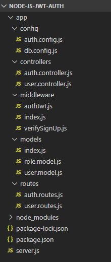

## Node.js Token Based Authentication & Authorization


#### Project Setup
```
  npm install
```

#### Run
```
  npm start
```

## Rest APIs 

| Methods | Urls             | Actions                 |
|---------|------------------|-------------------------|
| POST    | /api/auth/singup |Singup new account       |
| POST    | /api/auth/singin | Login an account        |
| GET     | /api/test/all    | Retrieve public content |
| GET     | /api/test/user   | Access User Content     |
| GET     | /api/test/mod    | Access Moderator Content|
| GET     | /api/test/admin  | Access Admin Content    |


## Technology

* Express.js
* bcryptjs
* jsonwebtoken
* Sequelize
* MySQL
* Nodemon
* RestClient

## Project Structure



## Reference

* *[Authentication & Authorization in Node](https://bezkoder.com/node-js-jwt-authentication-mysql/)*
